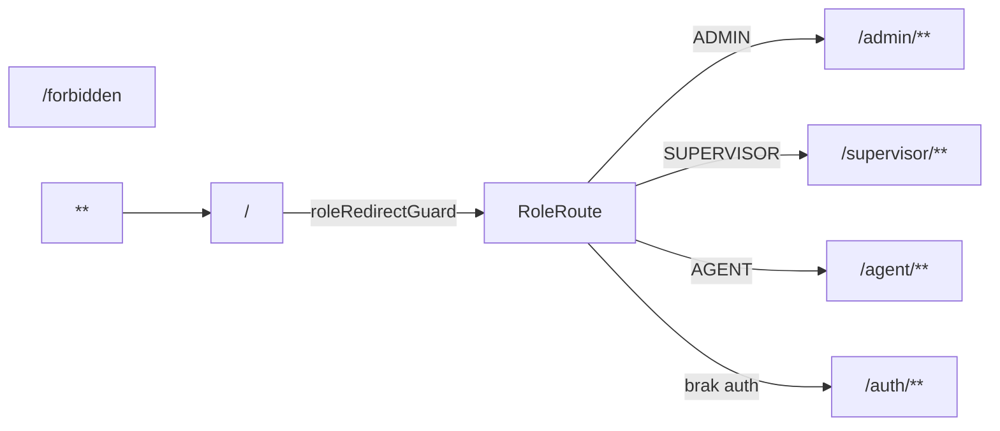
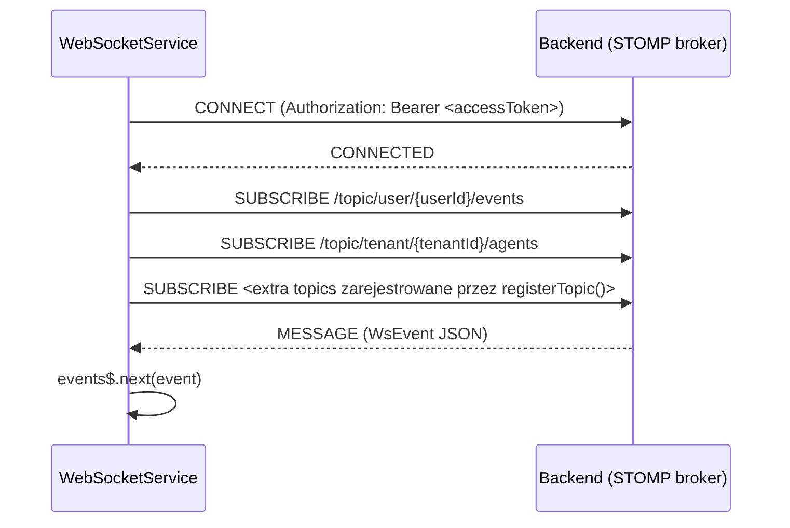
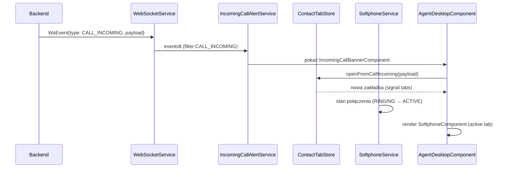

# Frontend – Angular (Contact Center SaaS)

Dokumentacja warstwy frontendowej projektu Contact Center SaaS. Frontend znajduje się w katalogu
`frontend/` i komunikuje się z backendem Spring Boot (`localhost:8080`) przez REST API (`/api/*`)
oraz natywny WebSocket (STOMP, `/ws-native`).

> Wersja Angular: **21.x** (standalone components, Signals, nowy builder `@angular/build`).
> Testy: **Vitest** (`@angular/build:unit-test`).

---

## 1. Struktura projektu

```
frontend/
├── src/
│   ├── app/
│   │   ├── app.config.ts          # globalna konfiguracja aplikacji (providery)
│   │   ├── app.routes.ts          # główna tablica trasowania (root)
│   │   ├── app.ts / app.html      # root component (<router-outlet>)
│   │   ├── core/                  # serwisy/guardy/interceptory/modele "core"
│   │   │   ├── guards/
│   │   │   ├── interceptors/
│   │   │   ├── models/
│   │   │   └── services/
│   │   ├── shared/                # komponenty/serwisy/style współdzielone
│   │   │   ├── components/
│   │   │   ├── models/
│   │   │   ├── services/
│   │   │   ├── pipes/  directives/  (obecnie tylko .gitkeep)
│   │   │   └── styles/
│   │   └── features/              # moduły funkcjonalne per domena/rola
│   │       ├── admin/
│   │       ├── agent/
│   │       ├── auth/
│   │       ├── campaigns/         # (modele dot. kampanii leżą w supervisor)
│   │       ├── customers/
│   │       ├── dispositions/
│   │       ├── integrations/
│   │       ├── reports/
│   │       ├── supervisor/
│   │       └── tenants/
│   ├── environments/
│   │   ├── environment.ts          # dev (proxy)
│   │   └── environment.prod.ts     # prod
│   ├── styles.scss                 # globalny design system (tokeny CSS)
│   └── app/app.scss
├── public/
│   └── i18n/                        # pl.json, en.json, de.json, uk.json (Transloco)
├── proxy.conf.json                  # proxy dev-server → backend :8080
├── angular.json
├── package.json
├── eslint.config.js
└── .prettierrc(.json)
```

### Konwencje nazewnictwa

- **Prefiks selektora komponentu**:
  - `app-` – komponenty specyficzne dla feature (np. `app-agent-desktop`, `app-customer-detail`)
  - `cc-` – komponenty współdzielone / powłoka aplikacji (np. `cc-app-shell`, `cc-sidenav`,
    `cc-top-navbar`, `cc-breadcrumbs`, `cc-toast-container`)
  - Reguła wymuszona przez ESLint (`@angular-eslint/component-selector`, `prefix: ['app', 'cc']`,
    `style: 'kebab-case'`), oraz `@angular-eslint/directive-selector` (prefix `app`,
    `camelCase`).
- **Tylko standalone components** – brak `NgModule`. Każdy komponent ma `imports: [...]` w
  dekoratorze `@Component`.
- **Pliki**: `*.component.ts` + `*.component.html` + `*.component.scss` (niektóre małe
  komponenty mają inline `template`/`styles`), `*.service.ts`, `*.model.ts`, `*.routes.ts`,
  `*.store.ts` (lekkie store na signalach), `*.spec.ts` (testy Vitest).
- **Struktura feature**: `pages/` (komponenty-strony, routowalne), `components/` (komponenty
  pomocnicze osadzane w stronach), `services/`, `models/`.

### Stan – zasady ogólne (z `CLAUDE.md`)

- Preferowane: `signal()` / `computed()` / `effect()`.
- `BehaviorSubject` / RxJS – tylko dla strumieni (WebSocket, polling).
- Bridge RxJS ↔ Signals: `toSignal()` (np. `TopNavbarComponent.kpi`, `SidenavComponent.currentUrl`)
  oraz `takeUntilDestroyed(destroyRef)` do automatycznego odpisywania.

---

## 2. Routing – `app.routes.ts`

Plik `src/app/app.routes.ts` definiuje **trasy najwyższego poziomu**. Każda sekcja roli jest
lazy-loaded (`loadChildren`) i chroniona guardami.



### Tabela tras najwyższego poziomu

| Ścieżka | Guard | Rola | Lazy-loaded plik |
|---|---|---|---|
| `/` | `roleRedirectGuard` | — | `features/auth/login/login.component.ts` (nigdy nie renderowany – guard zawsze zwraca `UrlTree`) |
| `/auth/**` | — | publiczny | `features/auth/auth.routes.ts` |
| `/login` | — | redirect → `/auth/login` | — |
| `/forbidden` | — | publiczny | `features/auth/forbidden/forbidden.component.ts` |
| `/admin/**` | `authGuard`, `roleGuard` (`data.roles: ['ADMIN']`) | ADMIN | `features/admin/admin.routes.ts` |
| `/supervisor/**` | `authGuard`, `roleGuard` (`data.roles: ['SUPERVISOR']`) | SUPERVISOR | `features/supervisor/supervisor.routes.ts` |
| `/agent/**` | `authGuard`, `roleGuard` (`data.roles: ['AGENT']`) | AGENT | `features/agent/agent.routes.ts` |
| `**` | — | redirect → `/` | — |

Konfiguracja routera (`app.config.ts`):
- `withComponentInputBinding()` – parametry trasy/queryParams automatycznie bindowane jako
  `input()` w komponentach.
- `withRouterConfig({ paramsInheritanceStrategy: 'always' })` – dzieci dziedziczą parametry
  rodzica.

### `/auth/**` – `features/auth/auth.routes.ts`

| Ścieżka | Guard | Komponent |
|---|---|---|
| `auth/login` | — | `LoginComponent` |
| `auth/change-password` | `authGuard` | `ChangePasswordComponent` |
| `auth/` | — | redirect → `login` |

### `/admin/**` – `features/admin/admin.routes.ts`

Wszystko pod `AdminShellComponent` (powłoka z `cc-app-shell`).

| Ścieżka | Breadcrumb key | Komponent |
|---|---|---|
| `admin` | `role.admin` | `AdminShellComponent` (rodzic) |
| `admin` (redirect) | — | → `dashboard` |
| `admin/dashboard` | `nav.dashboard` | `AdminDashboardComponent` |
| `admin/tenants/**` | `nav.tenants` | `features/tenants/tenants.routes.ts` (`TENANT_ROUTES`) |
| `admin/users` | `nav.users` | `AdminUsersComponent` |
| `admin/metrics` | `nav.metrics` | `AdminMetricsPageComponent` |

`TENANT_ROUTES` ma tylko jedną trasę: `admin/tenants` → `TenantListComponent`.

### `/supervisor/**` – `features/supervisor/supervisor.routes.ts`

Wszystko pod `SupervisorShellComponent`.

| Ścieżka | Breadcrumb key | Dodatkowy guard / role | Komponent |
|---|---|---|---|
| `supervisor` (redirect) | — | — | → `dashboard` |
| `supervisor/dashboard` | `nav.dashboard` | — | `SupervisorDashboardComponent` |
| `supervisor/agents` | `nav.users` | — | `UserListComponent` (pages/users) |
| `supervisor/queues` | `nav.queues` | `roleGuard` (`SUPERVISOR`, `ADMIN`) | `QueueListComponent` |
| `supervisor/campaigns` | `nav.campaigns` | `roleGuard` (`SUPERVISOR`, `ADMIN`) | `CampaignListComponent` |
| `supervisor/customers` | `nav.customers` | — | `CustomerListComponent` |
| `supervisor/customers/import` | `nav.importCsv` | `roleGuard` | `CustomerImportComponent` |
| `supervisor/customers/new` | — | — | redirect → `supervisor/customers` |
| `supervisor/customers/:id` | `nav.customerProfile` | `roleGuard` | `CustomerDetailComponent` |
| `supervisor/reports` | `nav.reports` | `roleGuard` | `ReportsComponent` (placeholder) |
| `supervisor/reports/contacts` | `nav.reportsContacts` | `roleGuard` | `ContactsReportComponent` |
| `supervisor/settings/**` | `nav.configuration` | `roleGuard` | patrz tabela niżej |
| `supervisor/agent-groups` | `nav.agentGroups` | `roleGuard` | `AgentGroupsPageComponent` |
| `supervisor/callbacks` | `nav.callbacks` | `roleGuard` | `SupervisorCallbacksPageComponent` |
| `supervisor/ivr` | `nav.ivrEditor` | `roleGuard` | `IvrListComponent` |
| `supervisor/ivr/:ivrId` | `nav.ivrEditor` | `roleGuard` | `IvrEditorComponent` |

#### `supervisor/settings/**` (zagnieżdżone, redirect `''` → `email`)

| Ścieżka | Breadcrumb key | Komponent |
|---|---|---|
| `settings/email` | `nav.settingsEmail` | `EmailSettingsComponent` |
| `settings/phone-numbers` | `nav.settingsPhoneNumbers` | `PhoneNumbersComponent` |
| `settings/integrations/**` | `nav.settingsSocialMedia` | `INTEGRATIONS_ROUTES` (`features/integrations`) |
| `settings/email-templates` | `nav.settingsEmailTemplates` | `EmailTemplatesComponent` |
| `settings/disposition-sets` | `nav.settingsDispositionSets` | `DispositionSetsPageComponent` |
| `settings/twilio` | `nav.settingsTwilioConfig` | `TwilioConfigComponent` |
| `settings/ai-config` | `nav.settingsAiConfig` | `AiConfigComponent` |

`INTEGRATIONS_ROUTES` (`features/integrations/integrations.routes.ts`):

| Ścieżka | Komponent |
|---|---|
| `` (root) | `SocialIntegrationsComponent` |
| `oauth/callback/:platform` | `OauthCallbackComponent` |

### `/agent/**` – `features/agent/agent.routes.ts`

Wszystko pod `AgentShellComponent` (`cc-app-shell` + `cc-incoming-call-banner`).

| Ścieżka | Breadcrumb key | Komponent |
|---|---|---|
| `agent` (redirect) | — | → `desktop` |
| `agent/desktop` | `nav.desktop` | `AgentDesktopComponent` |
| `agent/customers` | `nav.customers` | `AgentCustomersTabComponent` |
| `agent/callbacks` | `nav.callbacks` | `AgentCallbacksPageComponent` |

---

## 3. Core (`src/app/core/`)

### 3.1 Guardy (`core/guards/`)

| Guard | Plik | Logika |
|---|---|---|
| `authGuard` | `auth.guard.ts` | Sprawdza token w pamięci (`TokenService.getAccessToken()`). Jeśli brak/wygasł, próbuje **silent refresh** (`AuthService.refresh()`) na bazie refresh tokenu z `sessionStorage`. Po nieudanym refreshu → `UrlTree` do `/auth/login`. |
| `roleGuard` | `role.guard.ts` | Porównuje `route.data['roles']` (np. `['ADMIN']`) z `AuthService.getUserRole()`. Brak dopasowania → `UrlTree` do `/forbidden`. |
| `roleRedirectGuard` | `role-redirect.guard.ts` | Guard trasy `/`. Niezalogowany → `/auth/login`. Zalogowany → `AuthService.getRoleDefaultRoute(role)` (`/admin`, `/supervisor`, `/agent`). |

### 3.2 Interceptory (`core/interceptors/`)

Zarejestrowane w `app.config.ts` w kolejności: `authInterceptor` → `errorHandlerInterceptor`.

#### `authInterceptor` (`auth.interceptor.ts`)
- Dodaje nagłówek `Authorization: Bearer <token>` do każdego requestu (poza endpointami auth:
  `/auth/login`, `/auth/refresh`, `/auth/logout`, `/auth/mfa/verify`).
- Na **401**: jeśli żaden refresh nie jest w toku, wywołuje `AuthService.refresh()`, podmienia
  token i powtarza request. Jeśli refresh już trwa – kolejne requesty czekają na
  `TokenRefreshService.refreshTokenSubject` (kolejkowanie przez `filter` + `take(1)`).
- `TokenRefreshService` (`core/services/token-refresh.service.ts`) – `@Injectable({providedIn:'root'})`
  przechowujący `isRefreshing: boolean` i `BehaviorSubject<string|null>` – wydzielony ze stanu
  modułowego właśnie po to, by uniknąć race condition między wielowiarstwowymi injectorami.

#### `errorHandlerInterceptor` (`error-handler.interceptor.ts`)
- Globalna obsługa błędów HTTP → toast (`NotificationService` + Transloco):
  - `status === 0` → `common.errorNetwork`
  - `401` → brak toastu (obsłużone przez `authInterceptor`, użytkownik i tak trafia na login)
  - `403` → `common.errorForbidden`
  - `404` (tylko dla `/api/*`) → `common.errorNotFound` (warning)
  - `>= 500` → `common.errorServer`
  - `4xx` inne → komunikat z body backendu (`error.message` / `error.error`) albo `common.errorBadRequest`
- Eksportuje `SKIP_ERROR_TOAST` (`HttpContextToken<boolean>`) – ustaw przez
  `{ context: new HttpContext().set(SKIP_ERROR_TOAST, true) }`, aby wyciszyć globalny toast dla
  konkretnego żądania (np. gdy komponent sam obsługuje błąd inline).

### 3.3 Serwisy (`core/services/`)

| Serwis | Rola |
|---|---|
| `AuthService` | Logowanie, MFA, zmiana hasła, refresh, logout. Stan jako `signal<JwtPayload\|null>` + `computed`: `isAuthenticated`, `currentRole`, `currentTenantId`, `currentTenantName`, `currentUserId`. |
| `TokenService` | Access token **tylko w pamięci** (mitygacja XSS, nigdy w `localStorage`). Refresh token w `sessionStorage` (czyszczony po zamknięciu karty/przeglądarki). Dekodowanie JWT (base64url) bez weryfikacji podpisu (weryfikacja jest po stronie backendu). |
| `TokenRefreshService` | Współdzielony stan silent-refresh dla interceptora (patrz wyżej). |
| `WebSocketService` | Klient STOMP po natywnym WS (`@stomp/stompjs`). Patrz sekcja 5. |
| `NotificationService` | System toastów: `signal<Toast[]>`, metody `success/error/warning/info`, auto-dismiss (`setTimeout`). |
| `BreadcrumbService` | Buduje breadcrumb z `router.routerState.snapshot` na podstawie `route.data['breadcrumb']` (klucze Transloco). |
| `LanguageService` | i18n – patrz sekcja 3.5. |
| `ThemeService` | Tryb light/dark/auto (`signal`, `effect`, `localStorage` klucz `kmn-theme`, `data-theme` na `<html>`, `prefers-color-scheme`). |
| `AgentGroupService` | CRUD grup agentów (współdzielony między admin/supervisor – w `core/services` bo używany w wielu miejscach). |
| `LoggingService` | Wysyłka logów frontendowych do backendu (`FrontendLogEntry`). |
| `AppErrorHandler` (`app-error-handler.ts`) | Globalny `ErrorHandler` (Angular `provideBrowserGlobalErrorListeners` + custom klasa) – łapie nieobsłużone błędy JS i wysyła do `LoggingService`. |

### 3.4 Modele (`core/models/`)

| Model | Opis |
|---|---|
| `jwt-payload.model.ts` | `JwtPayload` (`sub`, `iss`, `iat`, `exp`, `tenant_id`, `tenant_name?`, `user_id`, `role: UserRole`, `email`, `mfaVerified`) i `UserRole = 'ADMIN' \| 'SUPERVISOR' \| 'AGENT'`. |
| `paged-response.model.ts` | `PagedResponse<T>` – odpowiada Spring `Page<T>` (`content`, `page`, `size`, `totalElements`, `totalPages`, `first`, `last`). |
| `contact.model.ts` | Wspólny model kontaktu (kanał, status). |
| `customer-profile.model.ts` | Profil klienta używany w panelu klienta agenta. |
| `agent-group.model.ts` | Model grup agentów. |
| `language.model.ts` | `SUPPORTED_LANGUAGES`, `SupportedLanguage`, `LANGUAGE_STORAGE_KEY`. |
| `frontend-log-entry.model.ts` | Struktura logu wysyłanego do `LoggingService`. |

### 3.5 Transloco (i18n)

- Konfiguracja w `app.config.ts`:
  ```ts
  provideTransloco({
    config: {
      availableLangs: ['pl', 'en', 'de', 'uk'],
      defaultLang: 'pl',
      fallbackLang: 'en',
      reRenderOnLangChange: true,
      prodMode: environment.production,
    },
    loader: TranslocoHttpLoader,
  })
  ```
- `TranslocoHttpLoader` (`core/transloco-http-loader.ts`) – własny loader (Transloco nie ma
  wbudowanego dla nowego buildera), pobiera `GET /i18n/{lang}.json` (pliki w `public/i18n/`).
- **Pliki tłumaczeń**: `frontend/public/i18n/{pl,en,de,uk}.json` – płaski/zagnieżdżony JSON z
  kluczami typu `nav.dashboard`, `common.errorNetwork`, `role.admin` itd.
- **Inicjalizacja języka** – `LanguageService.init()` wywoływany przez `APP_INITIALIZER`:
  1. Jeśli użytkownik zalogowany → `GET /api/users/me/preferences` (`preferredLanguage`)
  2. Inaczej `localStorage` (`LANGUAGE_STORAGE_KEY`)
  3. Inaczej `navigator.language`
  4. Domyślnie `'pl'`
  - `setLanguage(lang)` zapisuje do `localStorage` **i** (jeśli zalogowany) `PUT
    /api/users/me/preferences`.
- **Jak dodać nowe tłumaczenie**: dodaj klucz do **wszystkich czterech** plików
  `public/i18n/{pl,en,de,uk}.json` (zachowując strukturę zagnieżdżoną), następnie w szablonie
  użyj `{{ 'klucz.podklucz' | transloco }}` lub `transloco.translate('klucz')` w TS (przez
  `inject(TranslocoService)` / `TranslocoModule` w `imports`).
- `LanguageSwitcherComponent` (`shared/components/language-switcher/`) – dropdown osadzony w
  `TopNavbarComponent`, własny stan `isOpen` (signal) + `HostListener` na klik poza komponentem.

---

## 4. Moduły features

### 4.1 `features/auth/`

**Cel**: logowanie, MFA, zmiana hasła, ekran „brak dostępu”.

| Komponent/Serwis | Opis |
|---|---|
| `LoginComponent` (`login/login.component.ts`) | Formularz logowania (reactive forms): tenant + email + password. Wieloetapowy: po `AuthService.login()` może wymagać `requiresMfa` (krok TOTP, `AuthService.verifyMfa()`) lub `passwordResetRequired` (redirect do `/auth/change-password`). |
| `ChangePasswordComponent` | Formularz zmiany hasła (`AuthService.changePassword()`), chroniony `authGuard`. |
| `ForbiddenComponent` | Statyczna strona 403, wyświetlana przez `roleGuard`. |
| `PublicTenantService` (`services/public-tenant.service.ts`) | Pobiera publiczną listę/identyfikację tenantów na ekranie logowania (bez auth). |

### 4.2 `features/admin/` (rola: ADMIN)

**Cel**: globalne zarządzanie platformą – tenants, użytkownicy cross-tenant, metryki systemowe.

| Element | Typ | Opis |
|---|---|---|
| `AdminShellComponent` | shell | `cc-app-shell` z breadcrumbiem `role.admin`. |
| `AdminDashboardComponent` (`pages/dashboard/`) | strona | Dashboard z KPI globalnymi, alertami systemowymi. Korzysta z `AdminMetricsService`. |
| `AdminMetricsPageComponent` (`pages/metrics/`) | strona | Szczegółowe metryki systemowe (per-tenant). |
| `AdminUsersComponent` (`pages/users/admin-users.component.ts`) | strona | Kontener listy użytkowników cross-tenant. |
| `AdminUserListComponent` (`pages/users/admin-user-list/`) | komponent | Tabela użytkowników wszystkich tenantów, filtrowanie, paginacja (`PagedResponse`). |
| `AdminUserFormComponent` (`pages/users/admin-user-form/`) | komponent | Formularz edycji/tworzenia użytkownika (reactive forms), wymuszony reset hasła. |
| `AdminMetricsService` (`services/admin-metrics.service.ts`) | serwis | Polling metryk (np. liczba aktywnych tenantów/agentów, alerty) – źródło `alertCount$` dla `SidenavComponent`. |
| `AdminUserService` (`services/admin-user.service.ts`) | serwis | CRUD użytkowników (`AdminUpdateUserRequest` itp.), `force-reset-password`. |
| Modele | `admin-metrics.model.ts`, `admin-user.model.ts` | DTO odpowiadające backendowi. |

**Tenants** (osadzone pod `/admin/tenants`, ale fizycznie w `features/tenants/`):

| Element | Opis |
|---|---|
| `TenantListComponent` (`tenant-list/`) | Tabela tenantów: paginacja, filtry, badge statusu, skeleton loading. |
| `TenantAddModalComponent` / `TenantEditModalComponent` | Natywne dialogi (`<dialog>`) – formularze z async-validatorem unikalności nazwy/slug. |
| `TenantDeactivateModalComponent` | Dialog dezaktywacji tenanta (z potwierdzeniem). |
| `TenantService` (`tenant.service.ts`) | `getTenants`, `createTenant`, `updateTenant`, `deactivateTenant`, `checkNameAvailability(ForUpdate)`. |
| `tenant.model.ts` | DTO `Tenant`, `CreateTenantRequest`, `UpdateTenantRequest`. |

### 4.3 `features/supervisor/` (rola: SUPERVISOR, część `ADMIN`)

Największy moduł – zarządzanie operacyjne tenantem.

#### Dashboard i agenci

| Element | Opis |
|---|---|
| `SupervisorShellComponent` | shell `cc-app-shell` z breadcrumbiem `role.supervisor`. |
| `SupervisorDashboardComponent` | Dashboard RT: KPI cards, tabela agentów (status, czas przerwy), wykres kolejek (CSS bar chart). Dane z `SupervisorMetricsService` – polling/WS event `SUPERVISOR_METRICS`, fullscreen API. |
| `pages/users/user-list/UserListComponent` | Lista agentów tenantu (tabela, filtry status/skill, skeleton). |
| `pages/users/user-form/UserFormComponent` | Formularz agenta – natywny dialog, multi-select umiejętności (chipy), walidator hasła. |
| `pages/users/user-delete-modal/UserDeleteModalComponent` | Dialog usunięcia (obsługa 409 → warning toast). |
| `pages/users/user-reset-password-modal/UserResetPasswordModalComponent` | Reset hasła agenta. |
| `services/user.service.ts` | CRUD agentów tenantu. |
| `services/supervisor-metrics.service.ts` | Real-time metryki supervisora (WS `SUPERVISOR_METRICS`). |

#### Kolejki (`pages/queues/`)

| Komponent | Opis |
|---|---|
| `QueueListComponent` | Lista kolejek (paginacja, filtr nazwy). |
| `QueueFormComponent` | Formularz tworzenia/edycji kolejki (strategia routingu z `QueueService.getRoutingStrategies()`). |
| `QueueDeleteModalComponent` | Dialog usunięcia. |
| `QueueAgentsModalComponent` | Przypisywanie agentów do kolejki. |
| `QueueAssignmentPanelComponent` | Panel przypisań (kolejka ↔ agenci/grupy). |
| `QueueDispositionsComponent` | Konfiguracja dyspozycji dla kolejki. |
| `QueueService` (`services/queue.service.ts`) | `getQueues(page,size,name?)`, `getQueue`, `createQueue`, `updateQueue` (PATCH), `deleteQueue`, `getRoutingStrategies`. Wzorzec API typowy dla całego projektu – `HttpParams` do paginacji/filtrów, `PagedResponse<T>`. |

#### Kampanie (`pages/campaigns/`)

| Komponent | Opis |
|---|---|
| `CampaignListComponent` | Lista kampanii z pollingiem (10s). |
| `CampaignFormComponent` | Formularz kampanii – natywny dialog, walidatory cross-field, signal-based selektor dni tygodnia. |
| `CampaignInfoComponent` | Szczegóły kampanii. |
| `CampaignContactsComponent` | Lista kontaktów kampanii + przycisk „Zadzwoń” (manualny dialer – `DialerService.manualCall()`, optymistyczna aktualizacja UI). |
| `CampaignImportComponent` | Import kontaktów do kampanii (CSV). |
| `CampaignDispositionsComponent` | Dyspozycje przypisane do kampanii. |
| `CampaignAssignmentModalComponent` | Przypisanie agentów/grup do kampanii. |
| `services/campaign.service.ts`, `services/dialer.service.ts` | API kampanii i wybierania numerów (`POST /api/dialer/manual/call`). |
| `models/campaign.model.ts` | DTO kampanii. |

#### Klienci (`pages/customers/`)

| Komponent | Opis |
|---|---|
| `CustomerListComponent` | Lista klientów tenantu (paginacja, wyszukiwanie). |
| `CustomerDetailComponent` | Szczegóły klienta + historia kontaktów (paginowana), klikalne wiersze → `ContactDetailModalComponent` (lazy-loading nagrania). |
| `CustomerCreateModalComponent` / `CustomerEditComponent` | Tworzenie/edycja klienta. |
| `CustomerDeleteModalComponent` | Usunięcie klienta. |
| `CustomerImportComponent` | Pełnoekranowy wizard importu CSV (`/supervisor/customers/import`), `CustomerImportStatus`. |
| `GdprAnonymizeModalComponent` | Anonimizacja danych klienta (RODO), `services/gdpr.service.ts`. |
| `services/customer.service.ts` | CRUD klientów + `getCustomerContacts`, `getContacts` (raport kontaktów), import CSV. |

#### Raporty (`pages/reports/`, `pages/contacts-report/`)

| Komponent | Opis |
|---|---|
| `ReportsComponent` (`reports-placeholder.component.ts`) | Placeholder/menu raportów historycznych (`/supervisor/reports`). |
| `ContactsReportComponent` (`/supervisor/reports/contacts`) | Raport kontaktów: 7 filtrów, tabela 9 kolumn z badgami statusu/kanału, paginacja 25/str., eksport CSV client-side. Korzysta z `customer.service.ts -> getContacts()`. |
| `services/reports.service.ts` | Pozostałe endpointy raportowe. |

#### Ustawienia (`pages/settings/`)

| Komponent | Opis |
|---|---|
| `EmailSettingsComponent` | Ustawienia konfiguracji email (per tenant). |
| `EmailTemplatesComponent` (`settings/email-templates/`) | CRUD szablonów email – 3 natywne dialogi, podgląd w `<iframe>`. |
| `DispositionSetsPageComponent` (`settings/disposition-sets/`) | Zarządzanie zestawami dyspozycji (`features/dispositions`). |
| `PhoneNumbersComponent` (`settings/phone-numbers/`) | Lista numerów telefonicznych Twilio. |
| `RoutingRulesComponent` + `RoutingRuleFormComponent` (`phone-numbers/routing-rules/`) | Reguły routingu numerów → kolejki/IVR. |
| `TwilioConfigComponent` (`pages/twilio-config/`) | Konfiguracja Twilio per tenant (zastąpiła starszy `settings/twilio-settings.component.ts`, który jest legacy/placeholder). |
| `AiConfigComponent` (`pages/ai-config/`) | Konfiguracja funkcji AI (np. podsumowania kontaktów) – `services/ai-config.service.ts`. |
| `services/email-config.service.ts`, `services/phone-number.service.ts`, `services/twilio-config.service.ts` | API odpowiednich ustawień. |

#### Integracje społecznościowe (`features/integrations/`, osadzone w `supervisor/settings/integrations`)

| Element | Opis |
|---|---|
| `SocialIntegrationsComponent` (`pages/social-integrations/`) | 3 karty platform (FB/IG/WA), flow OAuth redirect, dialog rozłączenia. |
| `OauthCallbackComponent` (`pages/oauth-callback/`) | Strona obsługująca powrót z OAuth (`/oauth/callback/:platform`). |
| `services/social-integration.service.ts` | API połączeń/integracji. |
| `models/social-integration.model.ts` | DTO. |

#### Grupy agentów (`pages/agent-groups/`)

| Komponent | Opis |
|---|---|
| `AgentGroupsPageComponent` | Lista grup agentów (`/supervisor/agent-groups`). |
| `CreateEditGroupModalComponent` | Tworzenie/edycja grupy. |
| `GroupMembersModalComponent` | Zarządzanie członkami grupy. |
| Serwis: `core/services/agent-group.service.ts` (współdzielony, bo używany też przez admin/agent). |

#### Callbacki (`pages/callbacks/`)

| Komponent | Opis |
|---|---|
| `SupervisorCallbacksPageComponent` | Widok wszystkich zaplanowanych callbacków tenantu. |
| `EditCallbackModalComponent` (`components/edit-callback-modal/`) | Edycja zaplanowanego callbacku. |

#### IVR (`pages/ivr/`)

| Komponent | Opis |
|---|---|
| `IvrListComponent` (`/supervisor/ivr`) | Lista flow IVR. |
| `IvrEditorComponent` (`/supervisor/ivr/:ivrId`) | Edytor drag & drop (HTML5 DnD + SVG Bezier dla połączeń), zoom/fit-to-view, persystencja pozycji węzłów, podpowiadanie zmiennych `${...}` w promptach, walidacja, mock upload audio. |
| `services/ivr.service.ts` | CRUD definicji IVR (pozycje węzłów w `localStorage` + backend). |
| `models/ivr.model.ts` | DTO węzłów/flow IVR. |

#### Twilio phone number select (komponent współdzielony w supervisorze)

| Element | Opis |
|---|---|
| `TwilioPhoneNumberSelectComponent` (`components/twilio-phone-number-select/`) | `ControlValueAccessor` – select numerów Twilio z 5 stanami (loading/empty/error/ok/allowNull), używany w `TwilioConfigComponent` i `CampaignFormComponent`. |

### 4.4 `features/agent/` (rola: AGENT)

**Cel**: stanowisko pracy agenta – obsługa kontaktów (telefon, czat, e-mail, social), softphone,
kalendarz, klienci, callbacki.

| Element | Opis |
|---|---|
| `AgentShellComponent` | `cc-app-shell` + `cc-incoming-call-banner`. W konstruktorze rejestruje `effect()` reagujący na `AgentStatusService.currentStatus()` – gdy status = `AVAILABLE`, inicjalizuje Twilio Device (`SoftphoneService.initializeTwilioDevice()`). |
| `AgentDesktopComponent` (`pages/agent-desktop/`) | Główna strona roboczo – header, sidebar, system zakładek kontaktów (`ContactTabStore`). Hostuje: `SoftphoneComponent`, `CustomerPanelComponent`, `DispositionPanelComponent`, `EmailContactComponent`, `SocialContactComponent`, `AgentCalendarComponent`. |
| `AgentCustomersTabComponent` (`pages/customers/`) | Wyszukiwanie klientów (`/agent/customers`) – debounce 300ms (`Subject`), drawer ze szczegółami, `@Output scheduleCallback`. |
| `AgentCallbacksPageComponent` (`pages/callbacks/`) | Lista własnych zaplanowanych callbacków agenta. |
| `AgentDashboardComponent` | Alternatywny/uzupełniający widok dashboardu agenta (KPI własne). |

#### Komponenty pomocnicze (`components/`)

| Komponent | Opis |
|---|---|
| `SoftphoneComponent` | UI softphonu WebRTC – 5 stanów (idle/ringing/connecting/active/ended), panel transferu (blind/attended). Stan w `SoftphoneService` (signal-based maszyna stanów, `@twilio/voice-sdk`). |
| `CustomerPanelComponent` | Panel danych klienta podczas kontaktu – 4 stany (loading/error/empty/data), czysty CSS skeleton. Dane z `CustomerLookupService` (cache `Map`, TTL 5 min, 404 → `null`). |
| `DispositionPanelComponent` | Panel ACW (After Call Work) – modal, timer, dropdown dyspozycji, textarea notatek. `ContactService.updateDisposition()` (`PATCH /api/contacts/{id}/disposition`). Aktywowany przez `effect()` monitorujący `SoftphoneService.session().state === 'ENDED'`. |
| `IncomingCallBannerComponent` | Banner przychodzącego połączenia (poza `<router-outlet>`, w shellu). |
| `TransferAgentListComponent` / `TransferQueueListComponent` | Listy do transferu połączenia (agent / kolejka). |
| `ManualCampaignPanelComponent` | Panel kampanii manualnych (preview/dial). |
| `AddBreakModalComponent` | Dialog rozpoczęcia przerwy (zmiana statusu agenta). |
| `RescheduleCallbackModalComponent`, `ScheduleInboundCallbackModalComponent` | Dialogi zarządzania callbackami. |
| `AgentCalendarComponent` (`pages/agent-desktop/agent-calendar/`) | Kalendarz tyg./dzień, 3 typy zdarzeń, FAB. Sterowany sygnałem `calendarTabActive` w `AgentDesktopComponent`. |
| `EmailContactComponent` (`pages/agent-desktop/email-contact/`) | Obsługa kontaktu e-mail – split-panel (wątek + odpowiedź), `<iframe srcdoc>` do renderowania treści, edytor `contenteditable`. |
| `EmailThreadMessageComponent` | Pojedyncza wiadomość w wątku e-mail. |
| `SocialContactComponent` (`pages/agent-desktop/social-contact/`) | Czat FB/IG/WA – WS event `SOCIAL_MESSAGE_RECEIVED`, infinite scroll, tryb read-only po zakończeniu kontaktu. |
| `AdhocEmailModalComponent` | Wysyłka maila ad-hoc do klienta. |
| `ManualCallbackModalComponent` | Tworzenie callbacku manualnego z karty klienta. |

#### Serwisy (`services/`)

| Serwis | Opis |
|---|---|
| `AgentStatusService` | Status agenta (`AVAILABLE`/`BUSY`/`BREAK`/...), zapis przez WS i/lub REST. |
| `SoftphoneService` | Maszyna stanów połączenia WebRTC (signals), integracja Twilio Voice SDK, transfer blind/attended. |
| `ContactTabStore` | Store zakładek aktywnych kontaktów – limity: `MAX_PHONE_TABS=1`, `MAX_ASYNC_TABS=3`, `MAX_TOTAL_TABS=4`. Metody `openFromCallIncoming`, `openFromCallOutbound`, `openFromContactAssigned`, `closeTab`, `markAsWrapping`, `updateTabStatus`. Stan: `signal<ContactTab[]>` + `computed` (`activeTab`, `wrappingTab`, liczniki). |
| `ContactService` | Operacje na kontakcie (m.in. `updateDisposition`). |
| `CustomerLookupService` | Lookup klienta z cache (`Map`, TTL 5 min). |
| `CustomerSearchService` | Wyszukiwanie klientów (debounce). |
| `QueueStateService` | Stan kolejki/oczekujących kontaktów dla agenta. |
| `CallbackService` / `ManualCallbackService` | CRUD callbacków. |
| `AgentCalendarService` | Zdarzenia kalendarza agenta. |
| `OutboundCallService` / `DialerService` | Inicjowanie połączeń wychodzących. |
| `EmailService` | Operacje na kontaktach e-mail (wątki, wysyłka, szablony). |
| `SocialContactService` | Operacje na kontaktach social media. |
| `AiSummaryService` | Podsumowania AI kontaktu (`AiSummaryPanelComponent` w `shared`). |
| `IncomingCallAlertService` | Alert dźwiękowy/wizualny dla połączeń przychodzących. |
| `AgentRecoveryService` | Odtwarzanie stanu po reconnect WS (rejestruje się przez `WebSocketService.onConnect()`). |

#### Modele (`models/`)

`agent-calendar.model.ts`, `agent-status.model.ts`, `callback.model.ts`, `call-session.model.ts`,
`contact.model.ts`, `contact-tab.model.ts` (`ContactTab`, `ContactType`, `ContactTabStatus`,
`CallDirection`), `customer-search.model.ts`, `disposition.model.ts`, `manual-callback.model.ts`,
`queue-item.model.ts`, `social-message.model.ts`, `ws-event.model.ts` (`WsEvent` i payloady, np.
`CallIncomingPayload`, `ContactAssignedPayload`).

### 4.5 `features/dispositions/`

**Cel**: definicje dyspozycji (wyników) kontaktów, współdzielone między supervisor settings i
panelem ACW agenta.

| Element | Opis |
|---|---|
| `services/disposition-set.service.ts` | CRUD zestawów dyspozycji (`DispositionSet`). |
| `services/custom-disposition.service.ts` | CRUD pojedynczych dyspozycji niestandardowych. |
| `models/disposition-set.model.ts`, `models/custom-disposition.model.ts` | DTO. |
| UI: `DispositionSetsPageComponent` (supervisor/settings) oraz `DispositionListEditorComponent` (shared, edycja listy dyspozycji w formularzu kolejki/kampanii). |

### 4.6 `features/customers/`, `features/campaigns/`, `features/reports/`

Te katalogi obecnie nie zawierają plików `.ts` poza ewentualnymi placeholderami – realna
implementacja klientów, kampanii i raportów żyje w `features/supervisor/pages/{customers,
campaigns, contacts-report, reports}/` (patrz sekcja 4.3). Te puste katalogi mogą być
zarezerwowane dla przyszłego refaktoru (wydzielenie modułów cross-role).

### 4.7 `features/tenants/`

Patrz sekcja 4.2 (Admin → Tenants) – fizycznie w `features/tenants/`, routowane z
`features/admin/admin.routes.ts` jako `loadChildren`.

---

## 5. Shared (`src/app/shared/`)

### 5.1 Komponenty (`shared/components/`)

| Komponent | Selektor | Opis |
|---|---|---|
| `AppShellComponent` | `cc-app-shell` | Powłoka layoutu: `cc-top-navbar` + `cc-sidenav` + `cc-breadcrumbs` + `<router-outlet>`. Zarządza otwarciem/zamknięciem sidenava (mobile vs desktop, breakpoint **1280px**), `Escape` zamyka drawer na mobile. |
| `TopNavbarComponent` | `cc-top-navbar` | Górny pasek: hamburger (mobile), KPI agenta (`AgentKpiService.kpi$` via `toSignal`), `LanguageSwitcherComponent`, przełącznik trybu (`ThemeService`), badge roli, przycisk wylogowania. |
| `SidenavComponent` | `cc-sidenav` | Menu boczne zależne od roli (`ADMIN_NAV` / `SUPERVISOR_NAV` / `AGENT_NAV` – statyczne tablice `NavItem[]` w pliku). Wsparcie dla zagnieżdżonych sekcji (`children`), auto-expand aktywnej sekcji (`effect` + `toSignal(router.events)`), tryb collapsed (ikony, `localStorage` `cc_sidenav_collapsed`), badge alertów admina (`AdminMetricsService.alertCount$`, widoczny tylko na `/admin/dashboard`). |
| `BreadcrumbsComponent` | `cc-breadcrumbs` | Renderuje `BreadcrumbService.breadcrumbs()`. |
| `ToastContainerComponent` | `cc-toast-container` | Renderuje `NotificationService.toasts()` – własny CSS (bez Angular Material). |
| `ConfirmDialogComponent` | — | Generyczny dialog potwierdzenia (natywny `<dialog>`). |
| `ContactDetailModalComponent` | — | Modal szczegółów kontaktu – 3 sekcje, lazy-loading nagrania (`AudioPlayerComponent`). |
| `AudioPlayerComponent` | — | Własny odtwarzacz audio na `HTMLAudioElement` (bez bibliotek UI). |
| `AiSummaryPanelComponent` | — | Panel podsumowania AI dla kontaktu (`AiSummaryService`). |
| `DispositionListEditorComponent` | — | Edytor listy dyspozycji (reużywany w formularzach kolejki/kampanii/zestawu dyspozycji). |
| `LanguageSwitcherComponent` | — | Dropdown wyboru języka, osadzony w `TopNavbarComponent`. |
| `SparklineComponent` | — | Mini-wykres trendu (czysty SVG/CSS) używany w KPI/dashboardach. |

> **Brak Angular Material** – cały UI (dialogi, dropdowny, toasty) jest budowany na natywnych
> elementach HTML (`<dialog>`) i custom CSS w oparciu o design tokeny z `styles.scss`.

### 5.2 Serwisy i modele shared

| Plik | Opis |
|---|---|
| `services/agent-kpi.service.ts` | `AgentKpiService.kpi$` – strumień KPI agenta (czas w statusie, liczba obsłużonych kontaktów) wyświetlany w `TopNavbarComponent`. |
| `models/agent-kpi.model.ts` | `AgentKpiResponse`. |

### 5.3 Style / design system (`styles.scss`, `shared/styles/`)

- **Globalne tokeny CSS** w `:root` (`src/styles.scss`, 264 linie):
  - **Legacy tokeny** (kolory hex, np. `--color-brand: #1565c0`, `--color-success`,
    `--color-danger`, promienie, czasy przejść `--duration-*`, `--ease-*`).
  - **Nowy design system (oklch)** – osobne palety dla `:root`/`[data-theme='light']` i
    `[data-theme='dark']`:
    - tła: `--bg-app`, `--bg-sidebar`, `--bg-surface`, `--bg-elevated`, `--bg-subtle`, `--bg-input`
    - tekst: `--text-1/2/3`, `--text-muted`
    - obramowania: `--border-1/2/strong`
    - akcenty/semantyka: `--accent*`, `--success*`, `--warning*`, `--danger*`, `--violet*`,
      `--neutral*`
    - cienie: `--shadow-sm/md/lg/pop`
    - radiusy: `--radius-sm/md/lg/xl`
  - Przełączanie trybu przez atrybut `data-theme="light"|"dark"` na `<html>`, zarządzane przez
    `ThemeService` (sekcja 3.3) – tryb `auto` nasłuchuje `prefers-color-scheme`.
- **`shared/styles/_contact-badges.scss`** – partial SCSS z placeholderami (`%badge-base`) i
  klasami `.channel-badge--{phone,email,chat,social}`, `.direction-badge--*`,
  `.status-badge--*` – **importowany w każdym komponencie wyświetlającym dane `ContactResponse`**
  (np. `ContactsReportComponent`, `CustomerDetailComponent`, `ContactDetailModalComponent`).
- Brak biblioteki Angular Material / Bootstrap – cały styling jest własny (SCSS + tokeny).

---

## 6. State management i komunikacja real-time

### 6.1 Wzorce stanu

- **Lokalny stan komponentu / store**: `signal()` + `computed()` (np. `ContactTabStore`,
  `SoftphoneService`, `SidenavComponent.expandedSections`).
- **Strumienie ciągłe** (WebSocket, polling): `Subject`/`BehaviorSubject` + RxJS operators
  (`switchMap`, `shareReplay({ refCount: true })`), następnie `toSignal()` w komponencie tam,
  gdzie wygodniej operować na signalu (np. `TopNavbarComponent.kpi`,
  `SidenavComponent.currentUrl`).
- **Efekty side-effect**: `effect()` – np. `AgentShellComponent` inicjalizuje Twilio Device na
  zmianę statusu agenta; `AgentDesktopComponent` otwiera `DispositionPanelComponent` na
  zakończenie połączenia (`SoftphoneService.session().state === 'ENDED'`).
- **Odpisywanie**: `takeUntilDestroyed(destroyRef)` (preferowane) – widoczne np. w
  `BreadcrumbService`, `SidenavComponent`.

### 6.2 WebSocket – `WebSocketService`

Klient **STOMP po natywnym WebSocket** (`@stomp/stompjs`, **nie** SockJS), URL z
`environment.wsUrl` (`ws://localhost:8080/ws-native` w dev, `/ws-native` w prod – serwowane przez
ten sam origin).



Najważniejsze cechy:
- `connectionState: signal<'CONNECTING'|'CONNECTED'|'DISCONNECTED'|'ERROR'>` – używany np. przez
  `SupervisorDashboardComponent` do banera "rozłączono, łączenie ponownie...".
- `beforeConnect` zawsze odświeża nagłówek `Authorization` z `AuthService.getAccessToken()` –
  istotne po silent-refresh.
- `reconnectDelay: 1000` – auto-reconnect wbudowany w `@stomp/stompjs`.
- **Subskrypcje domyślne** po `onConnect`:
  - `/topic/user/{userId}/events` – zdarzenia unicast do konkretnego użytkownika (np. przypisanie
    kontaktu, przychodzące połączenie).
  - `/topic/tenant/{tenantId}/agents` – broadcast do wszystkich agentów tenantu.
- **`registerTopic(destination)` / `unregisterTopic(destination)`** – mechanizm dla feature
  modułów (np. `SupervisorMetricsService` rejestruje `/topic/tenant/{id}/supervisor-metrics` dla
  zdarzeń `SUPERVISOR_METRICS`, `SocialContactComponent` dla `SOCIAL_MESSAGE_RECEIVED`). Topiki są
  automatycznie ponownie subskrybowane po reconnect.
- **`onConnect(callback)`** – rejestracja callbacków odtwarzania stanu po (re)connect, np.
  `AgentRecoveryService` synchronizuje zakładki kontaktów po utracie połączenia.
- Wszystkie zdarzenia trafiają do jednego strumienia `events$: Observable<WsEvent>` – konsumenci
  filtrują po `event.type` (typy zdefiniowane w `features/agent/models/ws-event.model.ts`, np.
  `CALL_INCOMING`, `CONTACT_ASSIGNED`, `SOCIAL_MESSAGE_RECEIVED`, `SUPERVISOR_METRICS`).

### 6.3 Przepływ danych – przykład: przychodzące połączenie



---

## 7. Build & konfiguracja

### 7.1 `app.config.ts` – providery globalne

```ts
providers: [
  provideBrowserGlobalErrorListeners(),
  provideRouter(routes, withComponentInputBinding(), withRouterConfig({ paramsInheritanceStrategy: 'always' })),
  provideHttpClient(withFetch(), withInterceptors([authInterceptor, errorHandlerInterceptor])),
  { provide: ErrorHandler, useClass: AppErrorHandler },
  provideTransloco({ ... }),
  { provide: APP_INITIALIZER, useFactory: ... languageService.init() ... },
]
```

- `withFetch()` – HttpClient na bazie `fetch` API (nowy backend Angular 17+).
- Brak `BrowserAnimationsModule`/Material – animacje robione czystym CSS.

### 7.2 Environments

| Plik | `apiUrl` | `wsUrl` | `production` |
|---|---|---|---|
| `environments/environment.ts` (dev) | `/api` | `ws://localhost:8080/ws-native` | `false` |
| `environments/environment.prod.ts` | `/api` | `/ws-native` | `true` |

Oba korzystają z relatywnego `/api` – w dev przez proxy, w prod przez reverse proxy/ten sam
origin co frontend.

### 7.3 Proxy dev-server – `proxy.conf.json`

```json
{
  "/api": { "target": "http://localhost:8080", "changeOrigin": true },
  "/ws": { "target": "ws://localhost:8080", "ws": true, "changeOrigin": true },
  "/ws-native": { "target": "ws://localhost:8080", "ws": true, "changeOrigin": true }
}
```

### 7.4 Komendy (uruchamiać z `frontend/`)

```bash
npm start          # ng serve --proxy-config proxy.conf.json (dev server + proxy → :8080)
npm run start:no-proxy
npm run build       # build (development config)
npm run build:prod  # ng build --configuration production
npm run watch       # build --watch (development)
npm test            # Vitest (przez @angular/build:unit-test)
npm run lint        # ESLint
npm run lint:fix
npm run format         # Prettier --write
npm run format:check   # Prettier --check
```

Backend musi działać na `localhost:8080` (patrz `docker compose ... up -d` w root `CLAUDE.md`).

---

## 8. Testy frontendowe (Vitest)

- Builder: `@angular/build:unit-test` (konfiguracja `test` w `angular.json`, `vitest.config.ts`
  zawiera jedynie `{ "builder": "@angular/build:unit-test" }` – resztę przejmuje Angular CLI).
- Uruchamianie: `npm test` (alias `ng test`).
- Konwencja plików: `*.spec.ts` współlokowane z plikiem testowanym (np.
  `core/services/auth.service.spec.ts`, `shared/components/language-switcher/language-switcher.component.spec.ts`,
  `features/agent/services/agent-calendar.service.spec.ts`).
- **Mocki HTTP**: `provideHttpClientTesting()` + `HttpTestingController`, `httpMock.verify()` w
  `afterEach`.
- **Mocki funkcji**: `vi.fn()` (Vitest), nie Jasmine `jasmine.createSpy`.
- **Brak `fakeAsync`/`tick`** – aplikacja jest zoneless, testy operują na promisach/`firstValueFrom`
  i rzeczywistych mikrotaskach.
- **Routing w testach**: `provideRouter([{ path: '**', children: [] }])` jako wildcard, by
  `router.navigate()` nie wybuchał.
- **JWT w testach**: budowanie fałszywego tokenu przez `buildFakeJwt()` – koduje payload base64url
  bez weryfikacji podpisu (zgodnie z `TokenService.decodePayload`).

### Przykład (`auth.service.spec.ts`, fragment)

```ts
function buildFakeJwt(payload: Partial<JwtPayload> & { exp: number }): string {
  const encoded = btoa(JSON.stringify(payload))
    .replace(/\+/g, '-').replace(/\//g, '_').replace(/=+$/, '');
  return `header.${encoded}.signature`;
}

describe('AuthService', () => {
  let service: AuthService;
  let httpMock: HttpTestingController;

  beforeEach(async () => {
    sessionStorage.clear();
    await TestBed.configureTestingModule({
      providers: [
        provideHttpClient(),
        provideHttpClientTesting(),
        provideRouter([{ path: '**', children: [] }]),
        AuthService,
        TokenService,
      ],
    }).compileComponents();

    service = TestBed.inject(AuthService);
    httpMock = TestBed.inject(HttpTestingController);
  });

  afterEach(() => {
    httpMock.verify();
    sessionStorage.clear();
  });

  // ...testy login/refresh/logout, weryfikacja HttpTestingController.expectOne()
});
```

---

## 9. Konwencje stylu (Prettier / ESLint)

### Prettier (`.prettierrc`)

```json
{
  "printWidth": 100,
  "tabWidth": 2,
  "useTabs": false,
  "semi": true,
  "singleQuote": true,
  "quoteProps": "as-needed",
  "trailingComma": "all",
  "bracketSpacing": true,
  "arrowParens": "always",
  "endOfLine": "lf",
  "overrides": [
    { "files": "*.html", "options": { "parser": "angular", "printWidth": 120 } }
  ]
}
```

- Pliki `.html` mają zwiększony `printWidth` do 120 i parser `angular`.
- `npm run format` / `format:check` – Prettier na `src/**/*.{ts,html,scss,json}`.
- `husky` + `lint-staged` – pre-commit hook uruchamia `eslint --fix` + `prettier --write` na
  zmienionych `.ts`, oraz `prettier --write` na `.html`/`.scss`.

### ESLint (`eslint.config.js`)

Najważniejsze reguły specyficzne dla projektu:

| Reguła | Wartość | Skutek |
|---|---|---|
| `@angular-eslint/directive-selector` | `{ type: 'attribute', prefix: 'app', style: 'camelCase' }` | Dyrektywy muszą mieć prefiks `app`. |
| `@angular-eslint/component-selector` | `{ type: 'element', prefix: ['app', 'cc'], style: 'kebab-case' }` | Selektory komponentów: `app-*` (feature) lub `cc-*` (shared/shell), kebab-case. |
| `@typescript-eslint/no-explicit-any` | `warn` | `any` dozwolone, ale z ostrzeżeniem. |
| `@typescript-eslint/explicit-function-return-type` | `off` | Brak wymogu jawnych typów zwracanych. |
| `@typescript-eslint/no-unused-vars` | `error`, `argsIgnorePattern: '^_'` | Nieużywane zmienne błądem; argumenty zaczynające się od `_` ignorowane (np. `_route`, `_state` w guardach). |
| `no-console` | `warn`, `allow: ['warn', 'error']` | `console.log` ostrzega; `console.warn`/`console.error` dozwolone. |

- Pliki `.html` korzystają z `angular.configs.templateRecommended` +
  `angular.configs.templateAccessibility` (reguły a11y w szablonach).
- `eslintConfigPrettier` jest zawsze **ostatnim** elementem konfiguracji – wyłącza reguły
  formatujące kolidujące z Prettierem.
- Komendy: `npm run lint`, `npm run lint:fix`.

---

## 10. Szybki onboarding – checklist dla nowego developera

1. `docker compose --env-file .env.local-demo -f docker-compose.yml -f docker-compose.local-demo.yml up -d --remove-orphans` (root repo) – uruchamia backend + infrastrukturę.
2. `cd frontend && npm install && npm start` – dev server na `http://localhost:4200` z proxy do `:8080`.
3. Zaloguj się przez `/auth/login` – po sukcesie trafisz na `/admin`, `/supervisor` lub `/agent`
   zależnie od roli w JWT (`roleRedirectGuard`).
4. Nowa strona w istniejącym module roli: dodaj wpis do odpowiedniego `*.routes.ts`
   (`loadComponent`, `data.breadcrumb`, ewentualnie `data.roles` + `roleGuard`), dodaj wpis do
   `NavItem[]` w `SidenavComponent` (odpowiednia tablica `ADMIN_NAV`/`SUPERVISOR_NAV`/`AGENT_NAV`).
5. Nowy komponent: standalone, `app-` lub `cc-` prefiks, `ChangeDetectionStrategy.OnPush`,
   `signal`/`computed` na stan, `inject()` w polach klasy.
6. Nowy serwis HTTP: wzorzec jak `QueueService` – `environment.apiUrl` + `HttpParams` dla
   paginacji/filtrów, `PagedResponse<T>` dla list.
7. Nowe tłumaczenie: dodaj klucz do **wszystkich** `public/i18n/{pl,en,de,uk}.json`.
8. Przed PR: `npm run lint:fix && npm run format && npm test` (oraz skill `/verify` dla
   pełnej weryfikacji frontend+backend).
