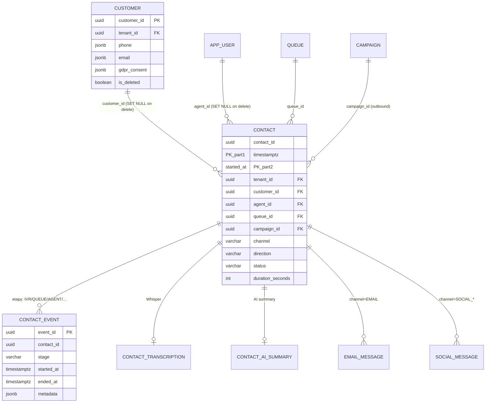
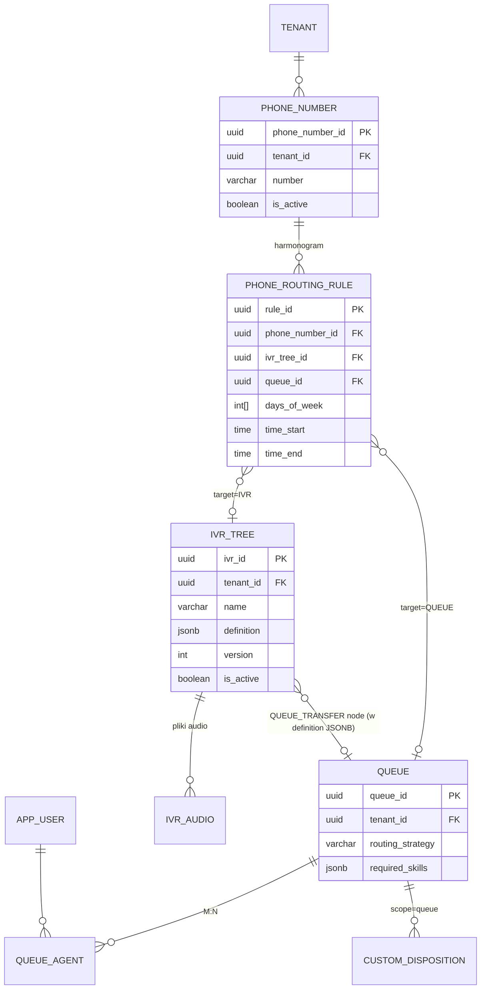

# Baza danych – dokumentacja techniczna

> Dokument onboardingowy dla warstwy danych Contact Center SaaS.
> Silnik: **PostgreSQL 16** (Docker), migracje **Flyway** (`backend/src/main/resources/db/migration/`,
> obecnie **73 pliki**, `V001`…`V073`), izolacja multi-tenant przez kolumnę `tenant_id`
> + **Row Level Security (RLS)**.

---

## 1. Konwencje migracji (Flyway)

### 1.1 Lokalizacja i nazewnictwo

- Katalog: `backend/src/main/resources/db/migration/`
- Format nazwy: `V<numer>__<opis_snake_case>.sql`, np. `V069__create_custom_disposition.sql`.
- Numeracja jest **sekwencyjna i ciągła** – każda nowa migracja dostaje kolejny wolny numer
  (`V074`, `V075`, ...). Nie ma "podnumerów" (`V069_1`).
- Plik seedów developerskich (dane testowe, **nie** część łańcucha walidowanego checksumami
  w taki sam sposób co migracje produkcyjne) leży osobno: `backend/src/main/resources/db/seed/`.

### 1.2 ZŁOTA ZASADA – nigdy nie edytuj zastosowanej migracji

> **Nigdy nie edytuj pliku migracji, który już został zastosowany** (czyli ma wpis w tabeli
> `flyway_schema_history`). Flyway liczy checksum (CRC32) treści każdego pliku przy starcie
> aplikacji (`validate-on-migrate: true`) – jakakolwiek zmiana w już zastosowanym pliku
> spowoduje błąd walidacji i **zablokuje start aplikacji**.

Zamiast edytować – zawsze tworzysz **nowy plik** `V0xx__fix_something.sql`, który:
- naprawia/koryguje strukturę wprowadzoną wcześniej (np. `ALTER TABLE ... DROP CONSTRAINT`,
  `DROP POLICY` + `CREATE POLICY` na nowo),
- lub idempotentnie dogania stan (`CREATE INDEX IF NOT EXISTS`, `ADD COLUMN IF NOT EXISTS`).

Przykład z rzeczywistej historii projektu: `V070__fix_custom_disposition_rls_and_indexes.sql`
naprawia błędy wprowadzone w `V069__create_custom_disposition.sql` (błędna nazwa zmiennej RLS,
brakujący `WITH CHECK`, brak `FORCE ROW LEVEL SECURITY`) – **bez modyfikacji V069**.

### 1.3 Ustawienia Flyway per profil

Konfiguracja: `backend/app/src/main/resources/application.yml` (+ `application-dev.yml`,
`application-prod.yml`).

```yaml
spring:
  flyway:
    locations:
      - classpath:db/migration
    baseline-on-migrate: false
    validate-on-migrate: true
    encoding: UTF-8
    default-schema: public
    table: flyway_schema_history
```

| Profil | `clean-on-validation-error` | `clean-disabled` |
|---|---|---|
| `dev`  | `false` | `true` |
| `prod` | (nieustawione → domyślne `false`) | `true` |

**Krytyczne:**
- `clean-disabled: true` jest ustawione na **obu** profilach – `flyway clean` jest zablokowany,
  nie da się przypadkowo wyczyścić bazy.
- `clean-on-validation-error: false` (dev) oznacza, że błąd checksumy **nie** wyzwala
  automatycznego czyszczenia bazy – aplikacja po prostu **nie wstanie**. To jest *sygnał*
  (nie błąd do "naprawienia przez wyłączenie walidacji"), że ktoś naruszył zasadę z 1.2.
- Następujące ustawienia **nigdy nie mogą trafić na żaden profil**, a zwłaszcza prod:
  `clean-on-validation-error: true`, `clean-disabled: false`.

### 1.4 Jak naprawić błąd checksumy "ręcznie" (sytuacja wyjątkowa)

Jeśli migracja już trafiła do współdzielonej bazy (np. dev) z błędem, a poprawiony plik
`Vxxx__fix_*.sql` nie wystarcza (np. trzeba poprawić zarejestrowany checksum), operację
wykonuje się **ręcznie przez psql** na tabeli `flyway_schema_history` – tak jak
udokumentowano dla `V070` (ręczny `INSERT` z poprawnym checksumem CRC32). To wyjątek,
nie standardowa praktyka – domyślnie zawsze wystarcza nowy plik `Vxxx__fix_*.sql`.

---

## 2. Multi-tenancy w bazie danych

Izolacja danych jest realizowana **dwuwarstwowo**:

1. **Warstwa aplikacji** – każde repozytorium rozszerza `TenantAwareRepository` i przed
   każdym zapisem wywołuje `assertSameTenant(entity.getTenantId())` (patrz `04-backend.md`).
2. **Warstwa bazy danych** – **Row Level Security (RLS)**, wprowadzona w `V012`, jako
   **druga linia obrony** (defense in depth) – nawet błąd w warstwie repozytorium nie
   spowoduje wycieku danych między tenantami.

### 2.1 Kolumna `tenant_id`

Każda tabela domenowa zawiera kolumnę `tenant_id UUID NOT NULL` (komentarz schematu z `V001`:
*"Multi-tenant: każda tabela zawiera kolumnę tenant_id UUID NOT NULL"*). Wyjątki:
- `audit_log.tenant_id` jest **nullable** – `NULL` oznacza zdarzenie globalne (np. utworzenie
  tenanta), widoczne dla wszystkich.
- Tabele referencyjne bez kontekstu tenanta (np. `cron_log`) nie mają `tenant_id`.

### 2.2 Role bazodanowe (V012)

```sql
-- Rola aplikacyjna: podlega RLS
CREATE ROLE app_user NOLOGIN NOSUPERUSER NOCREATEDB NOCREATEROLE NOBYPASSRLS;

-- Rola administracyjna/migracyjna: omija RLS
CREATE ROLE admin_user NOLOGIN NOSUPERUSER NOCREATEDB NOCREATEROLE BYPASSRLS;
```

- `app_user` (rola DB, **nie** mylić z tabelą `app_user`!) – ma `SELECT/INSERT/UPDATE/DELETE`,
  **podlega** wszystkim politykom RLS. Tego konta używa aplikacja Spring Boot w runtime.
- `admin_user` – `BYPASSRLS = TRUE`, pełne `ALL PRIVILEGES`. Tego konta używa **Flyway**
  i operacje administracyjne/ETL cross-tenant. **Nigdy nie używaj roli `app_user` w migracjach.**

### 2.3 Ustawienie kontekstu tenanta

Aplikacja ustawia zmienną sesji/transakcji przed każdym zapytaniem:

```sql
SET LOCAL app.current_tenant_id = '<uuid tenanta>';
```

Polityki RLS odczytują tę wartość przez `current_setting('app.current_tenant_id', TRUE)::UUID`.
Funkcja pomocnicza `set_tenant_context()` (utworzona w `V023__create_set_tenant_context_function.sql`)
opakowuje to ustawienie po stronie bazy.

> **UWAGA – znana niekonsekwencja w schemacie:** część nowszych migracji (`V059`, `V064`,
> `V067`, `V068`) używa zmiennej `app.tenant_id` (bez `current_`) w politykach RLS, podczas
> gdy konwencja ustalona w `V012` i utrwalona w `V042`/`V048`/`V051`/`V070` to
> `app.current_tenant_id`. Jeśli dodajesz nową tabelę z RLS – **zawsze używaj
> `app.current_tenant_id`** (zgodnie z tym, co faktycznie ustawia aplikacja) i jeśli
> natrafisz na tabelę z `app.tenant_id`, zgłoś to jako kandydata do migracji `Vxxx__fix_*`.

### 2.4 Przykładowe polityki RLS (z `V012`)

```sql
ALTER TABLE customer ENABLE ROW LEVEL SECURITY;
ALTER TABLE customer FORCE ROW LEVEL SECURITY;  -- nawet właściciel tabeli podlega RLS

CREATE POLICY pol_customer_select ON customer
    FOR SELECT
    USING (tenant_id = current_setting('app.current_tenant_id', TRUE)::UUID);

CREATE POLICY pol_customer_insert ON customer
    FOR INSERT
    WITH CHECK (tenant_id = current_setting('app.current_tenant_id', TRUE)::UUID);

CREATE POLICY pol_customer_update ON customer
    FOR UPDATE
    USING      (tenant_id = current_setting('app.current_tenant_id', TRUE)::UUID)
    WITH CHECK (tenant_id = current_setting('app.current_tenant_id', TRUE)::UUID);
```

Wzorzec "jedna polityka `ALL`" (nowszy, prostszy, używany od `V042`):

```sql
ALTER TABLE agent_group ENABLE ROW LEVEL SECURITY;

CREATE POLICY agent_group_tenant_isolation ON agent_group
    USING (tenant_id = current_setting('app.current_tenant_id', TRUE)::uuid);
```

Tabele z RLS aktywnym (`ENABLE ROW LEVEL SECURITY`) – pełna lista wg migracji:
`customer`, `contact`, `campaign`, `queue`, `app_user`, `ivr_tree`, `audit_log`,
`email_message`, `social_message`, `social_integration` (V012), `agent_group` (V042),
`agent_break` (V048), `tenant_twilio_config` (V051), `phone_number`,
`phone_routing_rule` (V039), `tenant_ai_config` (V064), `contact_transcription` (V067),
`contact_ai_summary` (V068), `custom_disposition` (V069/V070), `disposition_set`,
`disposition_set_item` (V071), `contact_event` (V059).

### 2.5 `assertSameTenant` – konwencja aplikacyjna

Każde repozytorium dziedziczy po `TenantAwareRepository` i przed `save()`/`update()`
wywołuje `assertSameTenant(entity.getTenantId())`, które porównuje `tenant_id` encji
z `TenantContext` aktualnego żądania i rzuca wyjątek przy niezgodności – RLS jest
warstwą zapasową, ten check wyłapuje błędy *przed* zapytaniem SQL.

---

## 3. Mapa schematu per domena

> Konwencja PK: w tym projekcie klucze główne **nie** nazywają się `id` (z wyjątkiem
> nowszych tabel z `V042+`, gdzie spotyka się zarówno `id`, jak i `<encja>_id` – patrz
> tabela poniżej). Przed pisaniem `REFERENCES` zawsze zweryfikuj realną nazwę PK przez
> `\d <tabela>` w psql.

### 3.1 Tenant / User / Auth (V002, V003, V012, V018, V020, V021, V050)

| Tabela | PK | Opis |
|---|---|---|
| `tenant` | `tenant_id` (UUID) | Klienci SaaS. `status` ENUM→VARCHAR (`ACTIVE/INACTIVE/SUSPENDED`, V019). `config JSONB` – limity (`max_agents`, `max_queues`, `max_campaigns`, `recording_retention_days`, `timezone`), walidowane CHECK-ami. |
| `app_user` | `user_id` (UUID) | Użytkownicy (ADMIN/SUPERVISOR/AGENT). Nazwa `app_user`, bo `user` jest słowem zarezerwowanym PG. `role`, `status` ENUM→VARCHAR (V019). `skills JSONB` (array, GIN index) – do skill-based routingu. `mfa_secret`, `mfa_enabled`, `is_deleted` (soft delete, V018), `first_name`/`last_name` (V020), `preferred_language` (V050), `is_active` (V018, status konta vs. dostępność – patrz V021 dla statusu OFFLINE). |
| `refresh_token` | `token_id` (UUID) | Tokeny JWT refresh. `token_hash` (SHA-256 hex, UNIQUE), `expires_at`, `is_revoked`, `user_agent`, `ip_address`. |

**Kluczowe indeksy:**
- `uq_user_tenant_email` – UNIQUE `(tenant_id, email) WHERE is_deleted=FALSE` – login per tenant.
- `idx_user_tenant_status` – `(tenant_id, status) WHERE is_deleted=FALSE` – routing (agenci AVAILABLE).
- `idx_user_skills_gin` – GIN na `skills` (operator `@>`/`?|`) – skill matching.
- `uq_refresh_token_hash` – lookup po hashu przy odświeżaniu sesji.
- `idx_refresh_token_cleanup` – `(expires_at, is_revoked)` (bez predykatu `WHERE NOW()...` – nie IMMUTABLE), czyszczone przez pg_cron.

**Enumy/statusy `app_user.status`** (po V019 jako VARCHAR + CHECK):
`ACTIVE`, `INACTIVE` (konto), `AVAILABLE`, `BUSY`, `BREAK`, `AFTER_CONTACT`, `OFFLINE` (V021).

**Role (`app_user.role`):** `ADMIN` (platforma, cross-tenant), `SUPERVISOR`, `AGENT`.

---

### 3.2 Customer (V006, V016, V017, V024, V025, V035)

| Tabela | PK | Opis |
|---|---|---|
| `customer` | `customer_id` (UUID) | Profil klienta końcowego. `phone JSONB` (array), `email JSONB` (array), `custom_fields JSONB` (object), `gdpr_consent JSONB` (`{"consent_given": bool, ...}`), `source` (`MANUAL/CSV_IMPORT/INBOUND_*/API`), `is_deleted` (soft delete – RODO anonimizacja). |

**Kluczowe indeksy (wyszukiwanie < 1s, US-09-01):**
- `idx_customer_name_trgm` – GIN trigram na `COALESCE(first_name,'')||' '||COALESCE(last_name,'')`, operator `%` (fuzzy search, wymaga `pg_trgm`).
- `idx_customer_phone_gin` / `idx_customer_email_gin` – GIN `jsonb_path_ops`, operator `@>`.
- `idx_customer_tenant_created`, `idx_customer_tenant_source`.

**Funkcja `search_customers(tenant_id, query, limit)`** – `STABLE SQL`, łączy trigram
similarity + exact match na `phone`/`email`, `ORDER BY similarity(...) DESC`. Poprawiona
w `V024__fix_search_customers_prefix_search.sql`.

**RODO:** anonimizacja przez `anonymize_customer()` (V013/V017), eksport danych przez
`export_customer_data()` (V017), widok historii klienta `v_customer_timeline` (UNION ALL
CONTACT + EMAIL + SOCIAL, V017).

---

### 3.3 Contact – rdzeń interakcji (V007, V040, V046, V054, V056, V058, V060, V061, V063, V065→V068, V073)

| Tabela | PK | Opis |
|---|---|---|
| `contact` | `(contact_id, started_at)` | **Partycjonowana RANGE po `started_at` (miesięcznie)**. Jeden kontakt = jedna interakcja (połączenie, email, chat). |
| `contact_event` | `event_id` (UUID) | Historia etapów kontaktu (V059) – `IVR/VOICEBOT/QUEUE/AGENT/ON_HOLD/CONSULTING/TRANSFER`. |
| `contact_transcription` | `transcription_id` (UUID) | Transkrypcja Whisper (V067), bez FK do `contact` (partycjonowana). |
| `contact_ai_summary` | `ai_summary_id` (UUID) | Podsumowanie AI (V068, wyodrębnione z `contact`), bez FK. |

**Kolumny `contact` (najważniejsze):**
- `tenant_id`, `customer_id` (nullable, `ON DELETE SET NULL` – anonimizacja RODO),
  `agent_id` (nullable, `ON DELETE SET NULL`), `queue_id`, `campaign_id`.
- `channel` ENUM→VARCHAR: `PHONE`, `EMAIL`, `SOCIAL_FACEBOOK`, `SOCIAL_INSTAGRAM`, `SOCIAL_WHATSAPP` (V025).
- `direction`: `INBOUND` / `OUTBOUND`.
- `status` (V025 → VARCHAR + CHECK, rozszerzany wielokrotnie – V030, V046, V056, V060, V073):
  `IVR` (V073 – w drzewie IVR, jeszcze nie w kolejce), `QUEUED`, `ASSIGNED`, `ACTIVE`, `ON_HOLD`,
  `COMPLETED`, `ABANDONED`, `ERROR`, `NOT_REACHED`, `TRANSFERRED`.
- `remote_address` (CLI/numer/email nadawcy – lookup bez JOIN).
- `queued_at` (**nullable od V073** – NULL dla statusu `IVR`), `assigned_at`, `started_at`
  (klucz partycjonowania), `ended_at`, `duration_seconds` (denormalizacja, liczona triggerem).
- `disposition_code`, `recording_url` (S3), `channel_metadata JSONB`, `notes` (V058),
  `callback_id` (V040 – link do `scheduled_callback`), `transferred_from_contact_id` (V061),
  `campaign_contact_record_id` (V063 – link do `campaign_contact`).

**Partycjonowanie:** `contact_2026_03`, `contact_2026_04`, `contact_2026_05`, `contact_default`
(fallback). Nowe partycje twórz funkcją `create_contact_partition(year, month)`.

**Kluczowe indeksy** (dziedziczone przez partycje):
- `idx_contact_customer_history` – `(tenant_id, customer_id, started_at DESC) WHERE customer_id IS NOT NULL`.
- `idx_contact_agent_history` – `(tenant_id, agent_id, started_at DESC) WHERE agent_id IS NOT NULL`.
- `idx_contact_tenant_status` – `(tenant_id, status) WHERE status IN ('QUEUED','ACTIVE','ON_HOLD')` – dashboard RT.
- `idx_contact_campaign`, `idx_contact_remote_address`, `idx_contact_channel_date`,
  `idx_contact_disposition`.
- `idx_contact_queue_date` / `idx_contact_duration` (V035, raporty kontaktów EPIC-12).

**Triggery:** `trg_contact_on_update` – auto-`updated_at` + auto-`duration_seconds`
(`EXTRACT(EPOCH FROM ended_at - started_at)`) gdy `ended_at` przechodzi z NULL na wartość.

**Pułapka indeksowa (rozwiązana):** nigdy `started_at::DATE`, `AT TIME ZONE`, `DATE_TRUNC`
w wyrażeniach indeksowych na `timestamptz` – te funkcje są `STABLE`, nie `IMMUTABLE`
(wynik zależy od `TimeZone` GUC), PostgreSQL odrzuci `CREATE INDEX`. Patrz poprawki
w `V007` i `V011`.

---

### 3.4 Campaign / Dialer / Scheduled callback (V009, V015, V027, V032–V038, V045, V047, V052–V057, V062)

| Tabela | PK | Opis |
|---|---|---|
| `campaign` | `campaign_id` (UUID) | Kampanie wychodzące. `type` (`OUTBOUND_VOICE`/`OUTBOUND_EMAIL`), `dialer_type` (`PROGRESSIVE`/`PREDICTIVE`/`MANUAL`), `status` (`DRAFT/SCHEDULED/RUNNING/PAUSED/STOPPED/COMPLETED`) – ENUM→VARCHAR V026. `schedule JSONB` (daty, godziny, dni tygodnia, timezone), `disposition_codes JSONB`, `max_attempts`, `retry_delay_minutes`, `queue_id` (FK→queue), `caller_id` (V052, E.164, fallback do `tenant_twilio_config.phone_number`), `ring_timeout` (V055), `all_agents BOOLEAN` (V062). |
| `campaign_contact` | `(record_id, campaign_id)` | **Partycjonowana LIST po `campaign_id`** – lista kontaktów kampanii (do 100k/kampania). `status` (`PENDING/DIALING/CONNECTED/NO_ANSWER/FAILED/COMPLETED/SKIPPED` + `ERROR`, `NOT_REACHED`, `CALLBACK`, `ASSIGNED` – rozszerzane w V034/V046/V053). `attempt_count`, `next_attempt_at`, `custom_fields JSONB`, `last_contact_id`. |
| `campaign_contact_archive` | – | Archiwum nie-partycjonowane (retencja domyślnie 5 lat). Wypełniane przez `archive_completed_campaign_contacts()` (V015). |
| `scheduled_callback` | `callback_id` (UUID) | Zaplanowane oddzwonienia (US-08-05). `status` (`PENDING/PROCESSING/COMPLETED/CANCELLED` + `NOT_REACHED`, V053). `campaign_id`/`agent_id`/`customer_id` nullable. `source`/`source_context` (V037/V038/V047 – pochodzenie: kampania, agent manual, inbound). `campaign_contact_record_id` (V054). |
| `campaign_agent` | `(campaign_id, agent_id)` | M:N kampania ↔ agent bezpośrednio (V062). |
| `campaign_agent_group` | `(campaign_id, group_id)` | M:N kampania ↔ grupa agentów (V062). |

**Partycjonowanie LIST `campaign_contact`:** partycje tworzone **dynamicznie przez aplikację**
przy tworzeniu kampanii: `CREATE TABLE campaign_contact_<uuid> PARTITION OF campaign_contact
FOR VALUES IN ('<campaign_uuid>')`. `campaign_contact_default` jako fallback.

**Krytyczny indeks dialera** (naprawiony w V033 po regresji z V031):
```sql
CREATE INDEX idx_campaign_contact_dialer
    ON campaign_contact (campaign_id, status, next_attempt_at)
    WHERE status IN ('PENDING', 'NO_ANSWER');  -- retry NO_ANSWER też w zasięgu dialera
```
Zapytanie dialera: `WHERE campaign_id=? AND status IN ('PENDING','NO_ANSWER') AND next_attempt_at <= NOW() ORDER BY next_attempt_at ASC LIMIT N`.

**Trójpoziomowe przypisanie agentów (V062, wzorzec analogiczny do `queue_agent_group` z V043):**
- `campaign.all_agents = TRUE` → dialer/panel manualny dostępny dla wszystkich agentów tenanta.
- `all_agents = FALSE` → tylko agenci z `campaign_agent` i/lub `campaign_agent_group`
  (przez `agent_group_member`). Indeksy `INCLUDE` dla efektywnego `UNION`
  (`idx_campaign_agent_group_lookup`, `idx_campaign_agent_member_lookup`).

**Disposition (V069–V072):**

| Tabela | PK | Opis |
|---|---|---|
| `custom_disposition` | `id` (UUID) | Własne dyspozycje per kampania **lub** kolejka (CHECK – dokładnie jedno z `campaign_id`/`queue_id`). `tone` (`positive/negative/neutral/warning`), `ordinal`, `is_active`. Unikalność `disposition_code` per zakres (partial unique indexes). |
| `disposition_set` | `id` (UUID) | Nazwane szablony zestawów dyspozycji (`UNIQUE(tenant_id, name)`). |
| `disposition_set_item` | `id` (UUID) | Elementy szablonu. Przypisanie zestawu **kopiuje** elementy do `custom_disposition` (snapshot, nie referencja). |

---

### 3.5 Queue / Routing / IVR (V008, V039, V042–V044)

| Tabela | PK | Opis |
|---|---|---|
| `queue` | `queue_id` (UUID) | Kolejki. `routing_strategy` (`ROUND_ROBIN/FIRST_AVAILABLE/SKILL_BASED`). `required_skills JSONB` (array, GIN), `sticky_agent_timeout_seconds`, `max_concurrent_contacts_per_agent`, `wait_config JSONB`, `email_address` (V029, UNIQUE per tenant, CHECK format email). |
| `queue_agent` | `(queue_id, agent_id)` | M:N agent ↔ kolejka. |
| `agent_group` | `group_id` (UUID) | Nazwane grupy agentów (`UNIQUE(tenant_id, name)`), V042. |
| `agent_group_member` | `(group_id, agent_id)` | M:N grupa ↔ agent. |
| `phone_number` | `phone_number_id` (UUID) | Numery telefonów tenanta (E.164, CHECK regex), V039. |
| `phone_routing_rule` | `rule_id` (UUID) | Harmonogram routingu numeru → IVR **albo** kolejka (CHECK – dokładnie jedno), `days_of_week INTEGER[]`, `time_start/time_end`. Trigger `check_routing_rule_collision()` – `CONSTRAINT TRIGGER DEFERRABLE` wykrywający nakładające się reguły dla tego samego numeru. |
| `ivr_tree` | `ivr_id` (UUID) | Drzewa IVR. `definition JSONB` (struktura nodes, patrz 5.3), `version INT` (auto-increment przez trigger przy zmianie `definition`), `is_active`. |
| `ivr_audio` | `audio_id` (UUID) | Pliki audio IVR (`UPLOADED`/`TTS`), `ivr_id` nullable (audio globalne tenanta). |

**Kluczowe indeksy:**
- `idx_queue_skills_gin` – GIN na `required_skills`.
- `idx_ivr_definition_gin` – GIN na całym `definition` JSONB.
- `idx_routing_rule_phone` / `idx_routing_rule_tenant` – partial `WHERE is_active`.
- `idx_agent_group_member_agent` / `_group` – obie strony relacji M:N.

**Widok `v_queue_available_agents`** (V008, przebudowany w V019 po enum→varchar) –
agenci `AVAILABLE`, `is_deleted=FALSE`, `queue.is_active=TRUE`; aplikacja dofiltrowuje
`agent_skills @> queue_required_skills` dla `SKILL_BASED`.

---

### 3.6 Email / Social (V010, V028, V029, V041)

| Tabela | PK | Opis |
|---|---|---|
| `email_message` | `message_id` (UUID) | Wiadomości email w ramach `contact` (1 contact = 1 wątek = N wiadomości). `contact_id` **nullable od V028** (np. email bez powiązanego kontaktu). `message_id_header`/`in_reply_to` (RFC 2822, deduplikacja IMAP – `UNIQUE(tenant_id, message_id_header) DEFERRABLE`). `attachments JSONB`, `delivery_status`. |
| `email_template` | `template_id` (UUID) | Szablony odpowiedzi (`UNIQUE(tenant_id, name)`), `variables JSONB`, `category`. |
| `email_routing_rule` | `rule_id` (UUID) | Reguły routingu emaili → `queue_id`, `conditions JSONB` (lista warunków `field/operator/value`), `priority`. |
| `social_integration` | `integration_id` (UUID) | Konfiguracja kont social media per tenant (`FACEBOOK/INSTAGRAM/WHATSAPP`). `access_token_encrypted BYTEA` (AES-256). `UNIQUE(tenant_id, platform, page_id)`. RLS DML policies dodane w V041. |
| `social_message` | `message_id` (UUID) | Wiadomości social media, `contact_id` (FK do contact), `external_message_id` – idempotentność webhooków (`UNIQUE(tenant_id, external_message_id)`). |

---

### 3.7 Konfiguracja integracji per tenant (V051, V064)

| Tabela | PK | Opis |
|---|---|---|
| `tenant_twilio_config` | `config_id` (UUID) | Jeden wiersz per tenant (`UNIQUE(tenant_id)`). Pola wrażliwe (`account_sid`, `auth_token`, `api_key_sid`, `api_key_secret`) szyfrowane AES-256-GCM przez JPA `AttributeConverter` – baza przechowuje `Base64(IV‖ciphertext)`. Plaintext: `twiml_app_sid`, `phone_number` (E.164), `status_callback_url`. |
| `tenant_ai_config` | `id` (UUID) | Konfiguracja dostawcy AI (`ANTHROPIC/OPENAI/AZURE_OPENAI`), `UNIQUE(tenant_id)`. `api_key_encrypted` – AES-256-GCM przez `EncryptedStringConverter`. Pola tylko-Azure: `azure_endpoint`, `azure_deployment_name`. `summary_prompt_template` (NULL = domyślny prompt aplikacji). |

Obie tabele: partial index `WHERE is_active`, RLS `USING (tenant_id = current_setting('app.current_tenant_id', TRUE)::uuid)`.

---

### 3.8 Agent groups / breaks (V042, V048)

| Tabela | PK | Opis |
|---|---|---|
| `agent_group` / `agent_group_member` | patrz 3.5 | – |
| `agent_break` | `id` (UUID) | Przerwy agentów. `break_type` CHECK (`LUNCH/SHORT_BREAK/TRAINING/OTHER` + `MEETING` z V057), `status` CHECK (`PLANNED/ACTIVE/COMPLETED/CANCELLED`), `chk_agent_break_time: end_time > start_time`. Indeks `(tenant_id, agent_id, start_time)`. |

---

### 3.9 Audit / GDPR / ETL / Cron (V004, V013, V014, V015, V017, V036, V045)

| Tabela | PK | Opis |
|---|---|---|
| `audit_log` | `(log_id, created_at)` | **Partycjonowana RANGE po `created_at` (miesięcznie)**. `tenant_id`/`user_id` nullable (operacje globalne/systemowe). `old_value`/`new_value JSONB` (GIN), retencja 2 lata (`drop_old_audit_log_partitions`). |
| `cron_log` | `log_id` (BIGSERIAL) | Log wykonań zadań pg_cron/maintenance. |
| `etl_sync_state` | – | Stan synchronizacji ETL → ClickHouse (V036), rozszerzony o `campaign_contact` w V045. |

**Funkcje GDPR (V013, V017):** `anonymize_customer()`, `export_customer_data()`
(rozszerzona o archiwum w V017), widok `v_customer_timeline` (historia klienta:
CONTACT + EMAIL + SOCIAL przez `UNION ALL`).

**pg_cron (V014):** zadania okresowe – tworzenie partycji `audit_log`/`contact` na
następny miesiąc, czyszczenie `refresh_token`, archiwizacja `campaign_contact`.

---

### 3.10 Widoki diagnostyczne i raportowe (V011, V016)

- `v_active_contacts` – aktywne kontakty (status `QUEUED/ACTIVE/ON_HOLD`).
- `v_queue_realtime_stats` – statystyki kolejek na żywo (przebudowany po V019).
- `v_rls_status` – status RLS per tabela (diagnostyka administracyjna).
- `v_index_health` – kondycja indeksów (bloat, usage – diagnostyka DBA).
- `mv_campaign_stats` – **materialized view** statystyk kampanii (V011, przebudowany w V053
  o kolumny `not_reached_records`, `callback_records`).

---

## 4. Diagramy ER (Mermaid)

### 4.1 Campaign + Dialer + Contact

```mermaid
erDiagram
    TENANT ||--o{ CAMPAIGN : "ma"
    TENANT ||--o{ CUSTOMER : "ma"
    CAMPAIGN ||--o{ CAMPAIGN_CONTACT : "lista kontaktow (LIST partition)"
    CAMPAIGN }o--o| QUEUE : "queue_id"
    CAMPAIGN ||--o{ CAMPAIGN_AGENT : "M:N"
    CAMPAIGN ||--o{ CAMPAIGN_AGENT_GROUP : "M:N"
    AGENT_GROUP ||--o{ CAMPAIGN_AGENT_GROUP : ""
    AGENT_GROUP ||--o{ AGENT_GROUP_MEMBER : ""
    APP_USER ||--o{ CAMPAIGN_AGENT : ""
    APP_USER ||--o{ AGENT_GROUP_MEMBER : ""
    CAMPAIGN_CONTACT }o--o| CUSTOMER : "customer_id (nullable)"
    CAMPAIGN_CONTACT ||--o| CONTACT : "last_contact_id"
    CAMPAIGN_CONTACT ||--o{ CAMPAIGN_CONTACT_ARCHIVE : "po 30 dniach od COMPLETED/STOPPED"
    CONTACT }o--o| SCHEDULED_CALLBACK : "callback_id"
    SCHEDULED_CALLBACK }o--o| CAMPAIGN : ""
    SCHEDULED_CALLBACK }o--o| APP_USER : "agent_id (sticky)"
    CAMPAIGN ||--o{ CUSTOM_DISPOSITION : "scope=campaign"
    QUEUE ||--o{ CUSTOM_DISPOSITION : "scope=queue"
    DISPOSITION_SET ||--o{ DISPOSITION_SET_ITEM : "template"

    TENANT {
        uuid tenant_id PK
        varchar name
        varchar status
        jsonb config
    }
    CAMPAIGN {
        uuid campaign_id PK
        uuid tenant_id FK
        varchar type
        varchar dialer_type
        varchar status
        jsonb schedule
        uuid queue_id FK
        boolean all_agents
        varchar caller_id
    }
    CAMPAIGN_CONTACT {
        uuid record_id PK
        uuid campaign_id PK_FK
        uuid tenant_id FK
        uuid customer_id FK
        varchar status
        int attempt_count
        timestamptz next_attempt_at
    }
    SCHEDULED_CALLBACK {
        uuid callback_id PK
        uuid tenant_id FK
        uuid campaign_id FK
        uuid customer_id FK
        uuid agent_id FK
        timestamptz scheduled_at
        varchar status
    }
```

### 4.2 Customer + Contact (historia interakcji, multi-kanał)



> Uwaga: `CONTACT` jest tabelą partycjonowaną (RANGE po `started_at`), więc `CONTACT_EVENT`,
> `CONTACT_TRANSCRIPTION` i `CONTACT_AI_SUMMARY` **nie mają fizycznego FK** do `contact` –
> powiązanie `contact_id` jest logiczne (PostgreSQL nie wspiera FK do partycjonowanej tabeli
> ze strony child).

### 4.3 Queue + Routing + IVR



---

## 5. Wzorce projektowe w schemacie

### 5.1 Soft delete

- `customer.is_deleted`, `app_user.is_deleted`, `scheduled_callback.is_deleted` (V032),
  `phone_number.is_deleted` (V039) – `BOOLEAN NOT NULL DEFAULT FALSE`.
- Indeksy filtrujące zawsze z `WHERE is_deleted = FALSE` (partial index) – mniejszy indeks,
  szybsze zapytania na "żywych" rekordach.
- Prawdziwe (nieodwracalne) usunięcie danych osobowych klienta realizuje
  `anonymize_customer()` (RODO) – nie `DELETE`.

### 5.2 Audyt: `created_at`/`updated_at` + trigger

Wzorzec powtarzany w prawie każdej tabeli:

```sql
created_at TIMESTAMPTZ NOT NULL DEFAULT NOW(),
updated_at TIMESTAMPTZ,
...
CREATE TRIGGER trg_<table>_updated_at
    BEFORE UPDATE ON <table>
    FOR EACH ROW
    EXECUTE FUNCTION fn_set_updated_at();
```

`fn_set_updated_at()` (zdefiniowana raz w `V002`) jest generyczną funkcją triggera
ustawiającą `NEW.updated_at = NOW()`.

Pełny audyt zmian (kto/co/kiedy, stan przed/po) trafia do `audit_log` (`old_value`/`new_value JSONB`)
– osobny mechanizm niż `updated_at`, używany do zdarzeń biznesowych (np. `CUSTOMER_ANONYMIZED`,
`CAMPAIGN_STARTED`), nie do każdego UPDATE.

### 5.3 Wersjonowanie

- `ivr_tree.version INT` – inkrementowane automatycznie przez `fn_ivr_version_increment()`
  **tylko gdy** `OLD.definition IS DISTINCT FROM NEW.definition` (czyli zmiana metadanych
  bez zmiany drzewa nie podnosi wersji).
- `V049__add_version_columns.sql` – dodaje kolumny optimistic-locking (`@Version` w JPA)
  do wybranych encji.

### 5.4 JSONB – kluczowe struktury

| Tabela.kolumna | Struktura | Walidacja |
|---|---|---|
| `tenant.config` | `{"max_agents": int, "max_queues": int, "max_campaigns": int, "recording_retention_days"?: int, "timezone"?: string}` | CHECK: wymagane klucze + `>= 0` |
| `app_user.skills` | `["SALES", "TECH_SUPPORT", ...]` (array) | `jsonb_typeof = 'array'` |
| `customer.phone` / `.email` | `["+48...", ...]` (array) | `jsonb_typeof = 'array'` |
| `customer.gdpr_consent` | `{"consent_given": bool, "consent_date": ts, "consent_source": str, "marketing_consent": bool, "data_processing_consent": bool}` | `jsonb_typeof = 'object'` |
| `customer.custom_fields` | dowolne pola definiowane przez supervisora | `jsonb_typeof = 'object'` |
| `campaign.schedule` | `{"start_date", "end_date", "active_hours": {"from","to"}, "active_days": [...], "timezone"}` | `jsonb_typeof = 'object'` |
| `campaign.disposition_codes` | `[{"code": "SALE", "label": "Sprzedaż"}, ...]` | – |
| `queue.required_skills` | `["SALES", "POLISH"]` | `jsonb_typeof = 'array'`, GIN index |
| `queue.wait_config` | `{"announce_wait_time": bool, "announce_interval_seconds": int}` | – |
| **`ivr_tree.definition`** | `{"nodes": [{"node_id","type": "MENU\|PLAY_AUDIO\|COLLECT_INPUT\|QUEUE_TRANSFER\|HANGUP\|VOICEBOT", "prompt", "audio_id"?, "options": [{"key","next_node_id"}], "queue_id"?, "timeout_seconds", "max_retries"}], "entry_node_id"}` | CHECK: `nodes` array + `entry_node_id` istnieje |
| `email_message.attachments` / `social_message.attachments` | `[{"filename"/"type","content_type"/"url","size_bytes",...}]` | `jsonb_typeof = 'array'` |
| `contact.channel_metadata` | SIP Call-ID, email thread-id, social conversation_id | – |
| `contact_event.metadata` | zależne od `stage` – patrz komentarz kolumny w `V059` (np. `{"ivr_tree_id","outcome"}`, `{"queue_id","queue_name"}`, `{"agent_id","agent_name"}`, `{"target","transfer_type"}`) | – |
| `email_routing_rule.conditions` | `[{"field","operator": "CONTAINS\|REGEX\|EQUALS","value"}]` | `jsonb_typeof = 'array'` |

### 5.5 ENUM → VARCHAR + CHECK (V019, V025, V026)

Pierwotnie typy domenowe (`tenant_status`, `user_role`, `contact_channel`, `campaign_status`
itd.) były natywnymi `CREATE TYPE ... AS ENUM`. Hibernate 6 binduje wartości enum jako
`VARCHAR` (JDBC type 12), co przy natywnym `ENUM` w Postgresie powoduje błąd
`column X is of type some_enum but expression is of type character varying`.

**Rozwiązanie:** konwersja kolumn na `VARCHAR(50)` + `CHECK (col IN (...))`. Te same
gwarancje integralności, zero problemów z JDBC. **Każda nowa kolumna "enumowa" w tym
projekcie powinna być od razu `VARCHAR + CHECK`, nie `CREATE TYPE ... AS ENUM`.**

Skutek praktyczny: dodanie nowej wartości statusu = nowa migracja `DROP CONSTRAINT` +
`ADD CONSTRAINT` z rozszerzoną listą (patrz V030, V046, V053, V056, V060, V073 dla
`contact.status` i `campaign_contact.status`).

### 5.6 Partycjonowanie – trzy strategie w jednym schemacie

| Tabela | Strategia | Powód |
|---|---|---|
| `audit_log` | RANGE po `created_at`, miesięcznie | Retencja 2 lata, duży wolumen, dane "append only". |
| `contact` | RANGE po `started_at`, miesięcznie | Historia wieloletnia, raporty zakresowe po datach. |
| `campaign_contact` | LIST po `campaign_id` | Izolacja dużych list (do 100k/kampania), łatwe `DROP` partycji po archiwizacji kampanii. |

Każda strategia ma funkcję pomocniczą do tworzenia partycji (`create_audit_log_partition`,
`create_contact_partition`) lub tworzenie partycji "na żądanie" przez aplikację
(`campaign_contact_<uuid>`). Wszystkie mają partycję `*_default` jako fallback.

---

## 6. Anti-pattern: zakaz przeciążonych kolumn (overloaded columns)

> **Zakaz:** nie używaj istniejącej kolumny do przechowywania semantycznie innej wartości
> tylko dlatego, że typ się zgadza.

**Przykład błędu (do czego to prowadzi):** `scheduled_callback.customer_id` (FK → `customer`)
użyty do przechowywania `campaign_contact.record_id` – dwie zupełnie różne encje, jeden typ
UUID, zero czytelności w kodzie i w danych. Każdy kolejny developer czytający
`scheduled_callback.customer_id = 'xxx'` zakłada (słusznie, wg nazwy!) że to FK do `customer`
– błędne dane prowadzą do złych JOIN-ów, błędnych raportów, a w najgorszym wypadku do
przecieku danych między encjami przy nieuważnym `SELECT`.

**Reguła:** każde nowe powiązanie = nowa kolumna z opisową nazwą (np.
`campaign_contact_record_id` dodana w `V054` jako osobna kolumna w `scheduled_callback`,
zamiast nadpisywać `customer_id`). Koszt migracji (`ADD COLUMN` + ewentualny `UPDATE`
przepisujący dane) jest jednorazowy; koszt utrzymania przeciążonej kolumny jest wieczny –
każdy nowy developer musi na nowo odkryć "tajne" znaczenie kolumny, a statyczna analiza
(IDE, code review, ORM) jest bezsilna wobec takiej niejednoznaczności.

Inny przykład **poprawnego** podejścia z historii projektu: gdy `ai_summary*` zaczęło
"przeciążać" partycjonowaną tabelę `contact` dodatkowymi kolumnami niezwiązanymi z core
modelem kontaktu, `V068` wyodrębnił je do osobnej tabeli `contact_ai_summary` – zamiast
dalej rozszerzać `contact` o coraz więcej opcjonalnych, rzadko wypełnionych kolumn.

---

## 7. Jak dodać nową tabelę/kolumnę – krok po kroku

1. **Sprawdź najwyższy istniejący numer migracji:**
   ```bash
   ls backend/src/main/resources/db/migration/ | sort -V | tail -1
   ```
   Twój plik to `V<numer+1>__<opis>.sql`.

2. **Zweryfikuj realne nazwy PK tabel, do których chcesz dodać FK** (przez psql lub grep
   po istniejących migracjach – nazwa PK to zwykle `<tabela>_id`, ale nie zawsze, patrz
   `agent_break.id`, `custom_disposition.id`):
   ```bash
   psql -U ccapp -d contact_center -c '\d <tabela>'
   ```

3. **Napisz DDL zgodnie z konwencjami:**
   - `tenant_id UUID NOT NULL REFERENCES tenant(tenant_id) ON DELETE CASCADE|RESTRICT`
     (CASCADE dla danych "podrzędnych" tenanta, RESTRICT gdy chcesz zablokować usunięcie
     tenanta z danymi).
   - Statusy/typy: `VARCHAR(N) + CHECK (col IN (...))`, **nie** `CREATE TYPE ... AS ENUM`
     (patrz 5.5).
   - `created_at TIMESTAMPTZ NOT NULL DEFAULT NOW()`, `updated_at TIMESTAMPTZ` +
     `CREATE TRIGGER ... EXECUTE FUNCTION fn_set_updated_at()`.
   - Pola JSONB: dodaj `CHECK (jsonb_typeof(col) = 'array'|'object')` i opisz strukturę
     w komentarzu `COMMENT ON COLUMN`.
   - Nowe powiązanie do innej encji = **nowa, opisowo nazwana kolumna** (sekcja 6), nigdy
     nadpisanie istniejącej.

4. **RLS dla nowej tabeli z `tenant_id`:**
   ```sql
   ALTER TABLE moja_tabela ENABLE ROW LEVEL SECURITY;
   ALTER TABLE moja_tabela FORCE ROW LEVEL SECURITY;  -- jeśli tabela krytyczna

   CREATE POLICY moja_tabela_tenant_isolation ON moja_tabela
       USING      (tenant_id = current_setting('app.current_tenant_id', TRUE)::UUID)
       WITH CHECK (tenant_id = current_setting('app.current_tenant_id', TRUE)::UUID);
   ```
   Użyj `app.current_tenant_id` (nie `app.tenant_id` – patrz 2.3).

5. **Indeksy** – zaprojektuj pod konkretne zapytania (nie "na wszelki wypadek"):
   - Filtr po `tenant_id` zawsze jako pierwsza kolumna złożonego indeksu.
   - `WHERE is_active`/`WHERE is_deleted = FALSE`/`WHERE status = 'X'` jako partial index,
     jeśli zapytanie zawsze filtruje po tym warunku.
   - Nigdy `::DATE`, `AT TIME ZONE`, `DATE_TRUNC` na `timestamptz` w wyrażeniu indeksu (5.6/2.3).

6. **Migracja istniejących danych** (jeśli dotyczy) – `UPDATE`/`INSERT ... SELECT` w tym
   samym pliku, **po** `CREATE TABLE`/`ALTER TABLE ADD COLUMN`, **przed** ewentualnym
   `DROP COLUMN` (wzorzec z `V068`: create → index → RLS → migracja danych → drop column).

7. **Build i testy:**
   ```bash
   cd backend
   mvn package -pl app -DskipTests   # weryfikacja, że migracja się aplikuje przy starcie
   mvn test -pl app                  # testy integracyjne (Testcontainers + Flyway)
   ```
   Jeśli aplikacja nie wstaje z błędem walidacji checksumy – **ktoś edytował już
   zastosowaną migrację**. Nie wyłączaj walidacji – znajdź i napraw przyczynę (sekcja 1.2).

8. **Aktualizacja seedów dev** (`backend/src/main/resources/db/seed/V999__dev_seed.sql`)
   jeśli nowa tabela/kolumna wymaga danych testowych dla obu tenantów demo.

9. **Jeśli coś poszło źle w już zastosowanej migracji** – nowy plik `V<n+1>__fix_*.sql`,
   nigdy edycja `V<n>`. Wzorzec: `V070__fix_custom_disposition_rls_and_indexes.sql` jako
   przykład poprawnego "fix" patcha (DROP POLICY + CREATE POLICY na nowo, dodatkowe
   `CREATE INDEX IF NOT EXISTS`).
