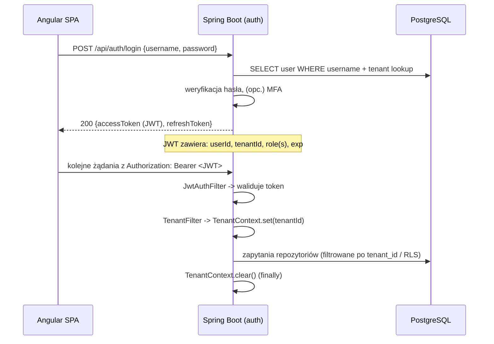
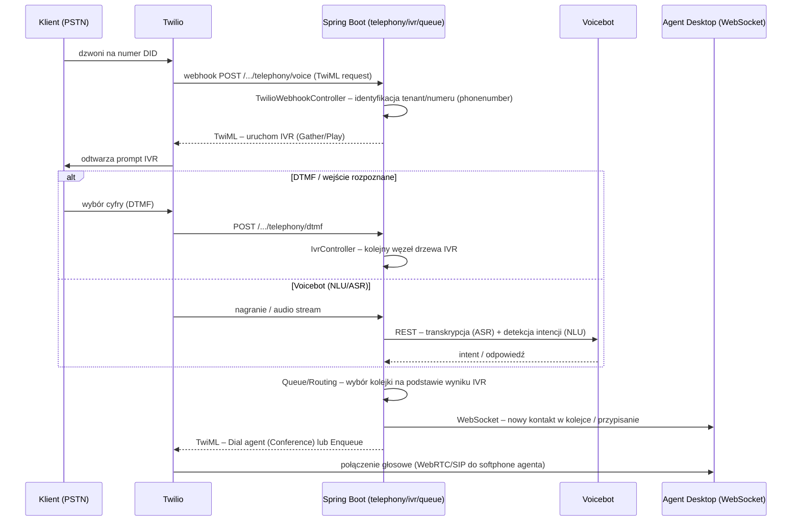
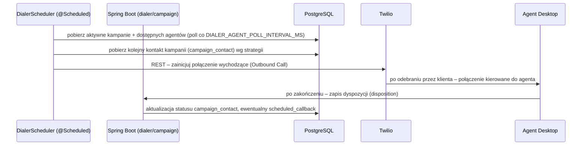
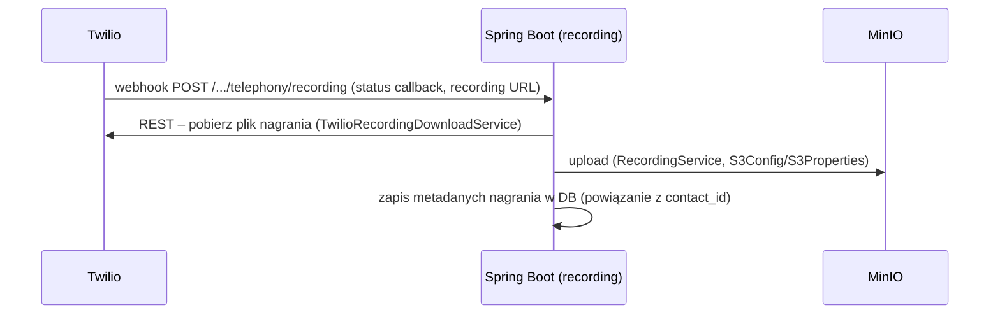
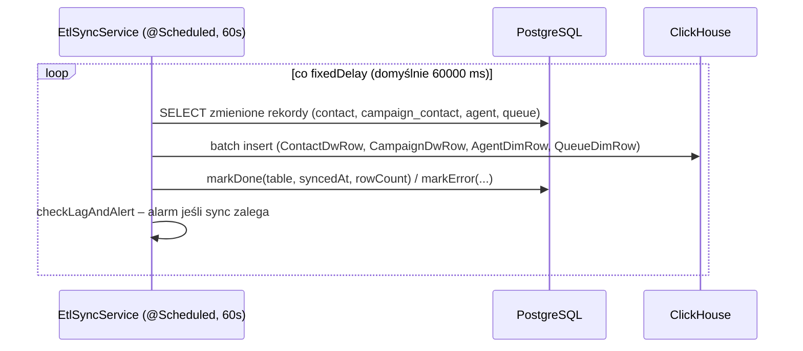

# 7. Kluczowe przepływy (end-to-end)

## 7.1 Logowanie i kontekst tenant-a

- `roleRedirectGuard` (frontend) po zalogowaniu przekierowuje użytkownika do `/admin`,
  `/supervisor` lub `/agent` w zależności od roli w JWT.
- Odświeżanie tokenu – `refreshToken` używany przez interceptor HTTP do automatycznego
  ponownego uzyskania `accessToken` przy 401.

## 7.2 Połączenie przychodzące (inbound call) + IVR + routing

Kluczowe klasy: `TwilioWebhookController`, `TwilioVoiceController`, `IvrController`,
moduł `queue` (routing), `WebSocketController`.

## 7.3 IVR – edycja i definicja drzewa

- Supervisor edytuje drzewo IVR w UI (`features/supervisor` – edytor z pozycjonowaniem węzłów,
  zoom, fit-to-view – patrz commity `feat(ivr)`).
- Definicja IVR (węzły, przejścia, prompty z interpolacją zmiennych `${...}`) jest
  persystowana jako JSONB w tabeli IVR (patrz [`06-database.md`](06-database.md)).
- `IvrController` udostępnia CRUD (`GET/POST /ivr`, `GET/DELETE /ivr/{id}`,
  `POST /ivr/{id}/activate|deactivate`, `POST /ivr/dtmf`).
- Logika retry/timeout dla `COLLECT_DTMF` i `MENU` jest ujednolicona (patrz commit
  `2a76cf7`) – brak osobnej ścieżki "no-input" dla `COLLECT_DTMF`.

## 7.4 Kampania outbound – progresywny dialer

- `DialerController` – status dialera (`GET /status`), zarządzanie callbackami
  (`/callbacks` CRUD), tryb manualny (`POST /manual/call`, `GET /manual/records`).
- `ManualCallbackController` – obsługa oddzwonień zaplanowanych przez agenta/klienta.
- Tryby: progresywny (automatyczny wybór numerów) i manualny (agent inicjuje połączenie z listy).

## 7.5 Obsługa kontaktu przez agenta (desktop)

1. Agent loguje się → ustawia status (np. `AVAILABLE`) w module `agentbreak`/`agentgroup`.
2. Backend (routing engine w `queue`) przypisuje kontakt z kolejki do agenta wg dostępności i
   grupy.
3. Frontend (`features/agent`) odbiera przez WebSocket informację o nowym kontakcie i otwiera
   widok aktywnej interakcji (softphone, dane klienta z `customer`).
4. Po zakończeniu agent wybiera **kod dyspozycji** (`disposition`) – zapisywany przy `contact`.
5. Jeśli dyspozycja wymaga oddzwonienia – tworzony `scheduled_callback` (moduł `dialer`).

## 7.6 Nagrania rozmów

Jeśli włączony voicebot (`VOICEBOT_ENABLED`), nagranie może być również przekazane do
`voicebot-recording` webhooka w celu transkrypcji/podsumowania rozmowy (`summarize.py`).

## 7.7 ETL → Data Warehouse (raporty)

Status synchronizacji widoczny w panelu admina przez `EtlStatusController` /
`AdminMetricsController` (`reports`/`admin`/`telemetry`).

## 7.8 Realtime UI (WebSocket/STOMP)

- Backend: `WebSocketController` – endpoint `/ws`, obsługa `@MessageMapping("/ping")` i
  wysyłka do `@SendToUser("/events")`; dodatkowo eventy broadcastowane do topiców (statusy
  agentów, KPI kolejek, alerty IVR).
- Frontend: serwis WebSocket w `core/services` nawiązuje połączenie STOMP po zalogowaniu,
  subskrybuje topiki właściwe dla roli (np. `supervisor` subskrybuje KPI wszystkich kolejek,
  `agent` – tylko własny status/przypisania).
- Dane napływające z WS aktualizują `signal()`/`computed()` w komponentach – brak ręcznego
  pollingu dla tych widoków.

## 7.9 GDPR / audyt

- Każda istotna operacja (np. zmiana danych klienta, eksport, usunięcie) jest logowana w
  module `auditlog` (kto, kiedy, co – encja + diff).
- Moduł `customer` wspiera right-to-erasure / eksport danych (zgodnie z PRD – sekcja GDPR w
  [`ARCHITECTURE.md`](../ARCHITECTURE.md) §6.4, do zweryfikowania przy konkretnej
  implementacji w `04-backend.md`).

## 7.10 Mapa "który moduł za co odpowiada w przepływie"

| Etap przepływu | Backend moduł(y) | Frontend feature |
|------------------|------------------|-------------------|
| Auth/JWT | `auth`, `user` | `auth` |
| IVR | `ivr`, `telephony` | `supervisor` (edytor IVR) |
| Routing/kolejki | `queue`, `agentgroup`, `agentbreak` | `supervisor`, `agent` |
| Kampanie/dialer | `campaign`, `dialer` | `campaigns`, `supervisor` |
| Baza klientów | `customer`, `contact` | `customers`, `agent` |
| Dyspozycje | `disposition` | `dispositions`, `agent` |
| Nagrania | `recording`, `telephony` | `supervisor` (odsłuch) |
| Raporty/DWH | `reports`, `telemetry`, `admin` | `reports`, `admin` |
| Audyt | `auditlog` | `admin` |
| Realtime | `websocket` | wszystkie (status agenta, KPI) |
| AI/Voicebot | (REST do `voicebot/`) | `supervisor` (konfiguracja), `agent` (podsumowania) |
