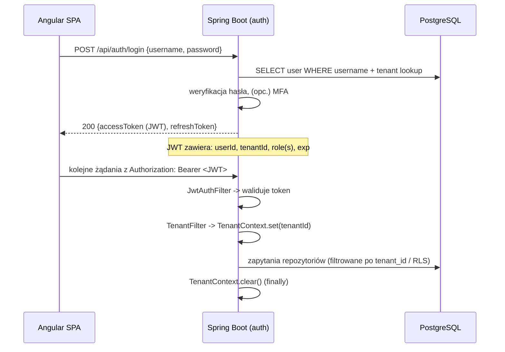
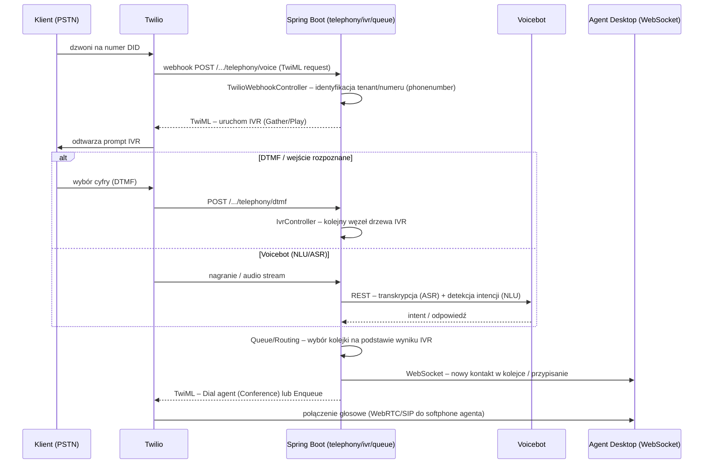
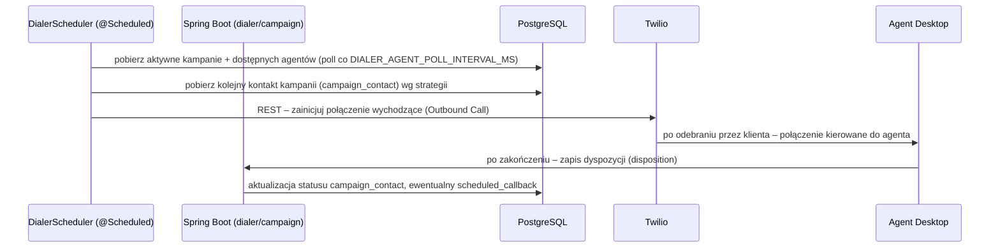
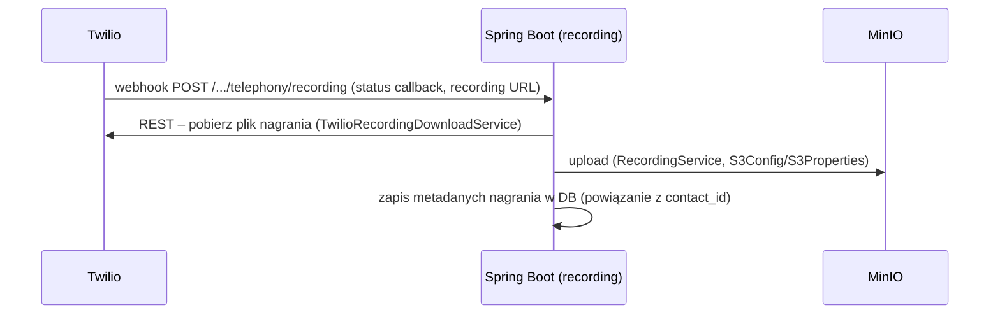
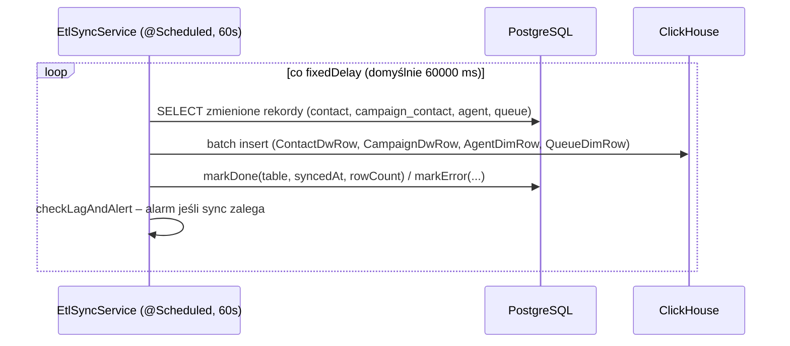
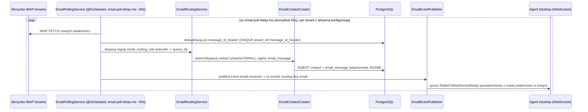
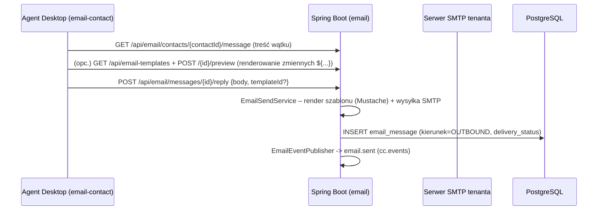
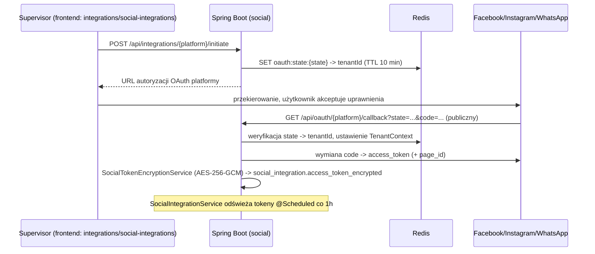
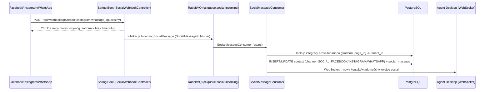
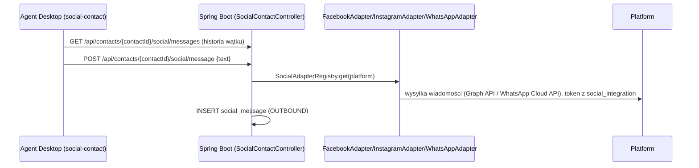

# 7. Kluczowe przepływy (end-to-end)

## 7.1 Logowanie i kontekst tenant-a

- `roleRedirectGuard` (frontend) po zalogowaniu przekierowuje użytkownika do `/admin`,
  `/supervisor` lub `/agent` w zależności od roli w JWT.
- Odświeżanie tokenu – `refreshToken` używany przez interceptor HTTP do automatycznego
  ponownego uzyskania `accessToken` przy 401.

## 7.2 Połączenie przychodzące (inbound call) + IVR + routing

Kluczowe klasy: `TwilioWebhookController`, `TwilioVoiceController`, `IvrController`,
moduł `queue` (routing), `WebSocketController`.

## 7.3 IVR – edycja i definicja drzewa

- Supervisor edytuje drzewo IVR w UI (`features/supervisor` – edytor z pozycjonowaniem węzłów,
  zoom, fit-to-view – patrz commity `feat(ivr)`).
- Definicja IVR (węzły, przejścia, prompty z interpolacją zmiennych `${...}`) jest
  persystowana jako JSONB w tabeli IVR (patrz [`06-database.md`](06-database.md)).
- `IvrController` udostępnia CRUD (`GET/POST /ivr`, `GET/DELETE /ivr/{id}`,
  `POST /ivr/{id}/activate|deactivate`, `POST /ivr/dtmf`).
- Logika retry/timeout dla `COLLECT_DTMF` i `MENU` jest ujednolicona (patrz commit
  `2a76cf7`) – brak osobnej ścieżki "no-input" dla `COLLECT_DTMF`.

## 7.4 Kampania outbound – progresywny dialer

- `DialerController` – status dialera (`GET /status`), zarządzanie callbackami
  (`/callbacks` CRUD), tryb manualny (`POST /manual/call`, `GET /manual/records`).
- `ManualCallbackController` – obsługa oddzwonień zaplanowanych przez agenta/klienta.
- Tryby: progresywny (automatyczny wybór numerów) i manualny (agent inicjuje połączenie z listy).

## 7.5 Obsługa kontaktu przez agenta (desktop)

1. Agent loguje się → ustawia status (np. `AVAILABLE`) w module `agentbreak`/`agentgroup`.
2. Backend (routing engine w `queue`) przypisuje kontakt z kolejki do agenta wg dostępności i
   grupy.
3. Frontend (`features/agent`) odbiera przez WebSocket informację o nowym kontakcie i otwiera
   widok aktywnej interakcji (softphone, dane klienta z `customer`).
4. Po zakończeniu agent wybiera **kod dyspozycji** (`disposition`) – zapisywany przy `contact`.
5. Jeśli dyspozycja wymaga oddzwonienia – tworzony `scheduled_callback` (moduł `dialer`).

## 7.6 Nagrania rozmów

Jeśli włączony voicebot (`VOICEBOT_ENABLED`), nagranie może być również przekazane do
`voicebot-recording` webhooka w celu transkrypcji/podsumowania rozmowy (`summarize.py`).

## 7.7 ETL → Data Warehouse (raporty)

Status synchronizacji widoczny w panelu admina przez `EtlStatusController` /
`AdminMetricsController` (`reports`/`admin`/`telemetry`).

## 7.8 Realtime UI (WebSocket/STOMP)

- Backend: `WebSocketController` – endpoint `/ws`, obsługa `@MessageMapping("/ping")` i
  wysyłka do `@SendToUser("/events")`; dodatkowo eventy broadcastowane do topiców (statusy
  agentów, KPI kolejek, alerty IVR).
- Frontend: serwis WebSocket w `core/services` nawiązuje połączenie STOMP po zalogowaniu,
  subskrybuje topiki właściwe dla roli (np. `supervisor` subskrybuje KPI wszystkich kolejek,
  `agent` – tylko własny status/przypisania).
- Dane napływające z WS aktualizują `signal()`/`computed()` w komponentach – brak ręcznego
  pollingu dla tych widoków.

## 7.9 GDPR / audyt

- Każda istotna operacja (np. zmiana danych klienta, eksport, usunięcie) jest logowana w
  module `auditlog` (kto, kiedy, co – encja + diff).
- Moduł `customer` wspiera right-to-erasure / eksport danych (zgodnie z PRD – sekcja GDPR w
  [`ARCHITECTURE.md`](../../ARCHITECTURE.md) §6.4, do zweryfikowania przy konkretnej
  implementacji w `04-backend.md`).

## 7.11 Kanał e-mail

Moduł `email` (`EmailController`, `EmailTemplateController`) – pełny cykl: odbiór przez IMAP
polling, routing do kolejki/kontaktu, odpowiedź agenta przez SMTP, szablony.

### 7.11.1 Konfiguracja konta (supervisor)

1. Supervisor wchodzi w `supervisor/settings/email-settings` (frontend) i wypełnia dane
   IMAP/SMTP (host, port, login, hasło, szyfrowanie).
2. `PUT /api/email/config` – zapis w `EmailAccountConfig` (hasła szyfrowane
   `EMAIL_ENCRYPTION_KEY`, AES-256-GCM przez `EmailEncryptionService`).
3. `POST /api/email/config/test` – weryfikacja połączenia IMAP/SMTP przed zapisem (lub po).

### 7.11.2 Odbiór wiadomości (inbound)

- Wątkowanie: `message_id_header`/`in_reply_to` (RFC 2822) – kolejne wiadomości w tym samym
  wątku trafiają do tego samego `contact` (`GET /api/email/threads/{messageIdHeader}`).
- Jeśli wiadomość nie pasuje do żadnej reguły routingu – trafia do domyślnej kolejki email
  tenanta (kolejka z ustawionym `email_address`, V029).

### 7.11.3 Obsługa przez agenta (outbound/reply)

- `POST /api/email/messages/outbound` – wysłanie nowej wiadomości (ad-hoc, np. z widoku klienta
  `adhoc-email-modal`), bez istniejącego wątku.
- Szablony (`email_template`) wsparte przez `TemplateVariableResolver` +
  `PredefinedTemplateVariable` – zmienne typu `${customer.firstName}`, `${agent.name}` itd.,
  walidowane przy `preview` (HTTP 422 jeśli brakuje zmiennej).

### 7.11.4 Frontend

| Widok | Komponent | Rola |
|-------|-----------|------|
| Skrzynka agenta | `features/agent/pages/agent-desktop/email-contact` | wątek email aktywnego kontaktu, odpowiedź |
| Wiadomość w wątku | `email-contact/email-thread-message` | render pojedynczej wiadomości (+ załączniki) |
| Email ad-hoc | `features/agent/pages/customers/adhoc-email-modal` | wysłanie e-maila do klienta poza kontaktem |
| Konfiguracja IMAP/SMTP | `features/supervisor/pages/settings/email-settings` | `EmailConfigService` |
| Szablony | `features/supervisor/pages/settings/email-templates` | CRUD + preview |

## 7.12 Kanał social media (Messenger / Instagram / WhatsApp – "chat")

Moduł `social` realizuje funkcję czatu z klientami przez platformy społecznościowe. Nie ma
odrębnego "widgetu czatu web" – kanały social *są* kanałem chat w tym systemie (PRD planuje
dodatkowo chatbota tekstowego – zob. 7.13).

### 7.12.1 Podłączenie integracji (OAuth) – supervisor/admin

### 7.12.2 Wiadomość przychodząca (inbound webhook)

- Idempotentność: `social_message.external_message_id` ma `UNIQUE(tenant_id, external_message_id)`
  – ponowne dostawy webhooka (retry platformy) nie tworzą duplikatów.
- Weryfikacja webhooka (GET `/api/webhooks/{platform}`) – standardowy handshake
  (`hub.verify_token` dla Meta).

### 7.12.3 Odpowiedź agenta (outbound)

### 7.12.4 Frontend

| Widok | Komponent | Rola |
|-------|-----------|------|
| Wątek social w desktopie agenta | `features/agent/pages/agent-desktop/social-contact` | odbiór/wysyłka wiadomości, `SocialContactService` |
| Model wiadomości | `features/agent/models/social-message.model.ts` | typy DTO |
| Zarządzanie integracjami | `features/integrations/pages/social-integrations` | lista/dodawanie/usuwanie integracji OAuth (`SocialIntegrationService`) |

## 7.13 Chatbot / Voicebot – status

- **Voicebot (zaimplementowany)**: wywoływany **w trakcie połączenia telefonicznego** z węzła
  IVR typu `VOICEBOT` (`IvrNodeType.VOICEBOT`, zob. 7.3) – ASR (Whisper), NLU (`detect_intent`)
  i ewentualna eskalacja do agenta przez RabbitMQ (`publish_escalation`). Endpoint:
  `POST /voicebot/turn` w `voicebot/app/main.py`.
- **Podsumowania AI (zaimplementowane)**: `POST /ai/summarize` – generuje podsumowanie
  rozmowy (transkrypcja → tekst), konfiguracja dostawcy AI per tenant w
  `TenantAiConfigController` (`/api/supervisor/ai-config`).
- **Chatbot tekstowy dla social/web (PRD, status: planowany)**: PRD (`PRD.md`, sekcja
  Automatyzacja, OQ-04) zakłada chatbota tekstowego dla kanałów social/web, ale **w kodzie
  backendu/frontendu nie istnieje odrębny moduł/endpoint chatbota** – obecnie kanały social
  (7.12) są obsługiwane wyłącznie przez agentów (bez automatycznych odpowiedzi bota). Przy
  podejmowaniu tego zadania należałoby zaprojektować nowy moduł (np. `chatbot`) analogicznie
  do wzorca `ivr`/`voicebot` (NLU z `voicebot/app/nlu.py` jest reużywalne).

## 7.14 Mapa "który moduł za co odpowiada w przepływie"

| Etap przepływu | Backend moduł(y) | Frontend feature |
|------------------|------------------|-------------------|
| Auth/JWT | `auth`, `user` | `auth` |
| IVR | `ivr`, `telephony` | `supervisor` (edytor IVR) |
| Routing/kolejki | `queue`, `agentgroup`, `agentbreak` | `supervisor`, `agent` |
| Kampanie/dialer | `campaign`, `dialer` | `campaigns`, `supervisor` |
| Baza klientów | `customer`, `contact` | `customers`, `agent` |
| Dyspozycje | `disposition` | `dispositions`, `agent` |
| Nagrania | `recording`, `telephony` | `supervisor` (odsłuch) |
| Email | `email` | `agent` (email-contact), `supervisor` (ustawienia/szablony) |
| Social media / chat | `social` | `agent` (social-contact), `integrations` (OAuth) |
| Raporty/DWH | `reports`, `telemetry`, `admin` | `reports`, `admin` |
| Audyt | `auditlog` | `admin` |
| Realtime | `websocket` | wszystkie (status agenta, KPI) |
| AI/Voicebot | (REST do `voicebot/`) | `supervisor` (konfiguracja), `agent` (podsumowania) |
| Chatbot tekstowy | nie zaimplementowano (PRD – planowane) | – |
