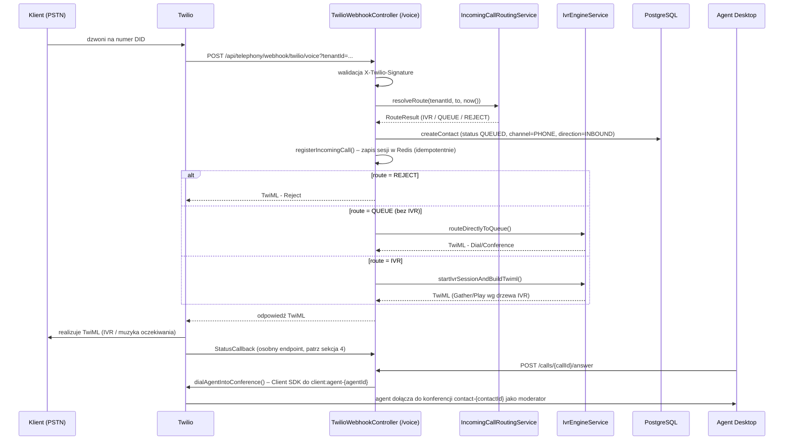
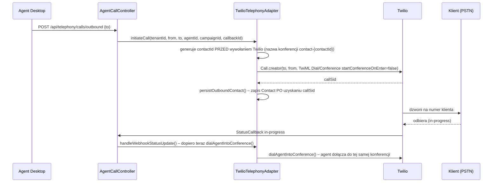
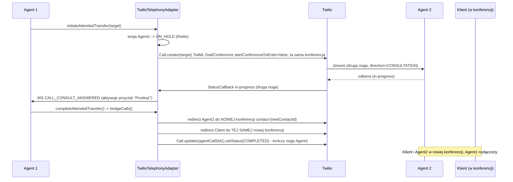

# Integracja Twilio — dokumentacja techniczna

> Ten dokument opisuje **stan faktyczny implementacji** integracji Twilio w Contact Center SaaS (backend `com.contactcenter.domain.telephony` / `com.contactcenter.api.telephony`, frontend `frontend/src/app/features/agent/**/softphone*`, `frontend/src/app/features/supervisor/**/twilio*`) — nie jest to dokument projektowy. Uzupełnia [`documentation/tech/04-backend.md`](../tech/04-backend.md) i [`documentation/tech/07-data-flows.md`](../tech/07-data-flows.md), które opisują telefonię w skrócie jako część całego systemu.

**Zakres:** adapter telefonii (Mock ↔ Twilio), obsługa połączeń przychodzących/wychodzących, webhooki i mapowanie statusów, transfer połączeń (blind/attended), nagrywanie, konfiguracja per-tenant (BYOT), integracja frontendowa (Twilio Voice JS SDK), bezpieczeństwo.

**Wersje:** Twilio Java SDK `10.9.1` (`backend/app/pom.xml`), `@twilio/voice-sdk` `^2.18.1` (`frontend/package.json`), Spring Boot `3.3.5` / Java `21`, Angular `^21.2.0`.

---

## Spis treści

1. [Architektura adaptera telefonii](#1-architektura-adaptera-telefonii)
2. [Połączenie przychodzące (inbound)](#2-połączenie-przychodzące-inbound)
3. [Połączenie wychodzące (outbound)](#3-połączenie-wychodzące-outbound)
4. [Webhooki i mapowanie statusów](#4-webhooki-i-mapowanie-statusów)
5. [Transfer połączeń](#5-transfer-połączeń)
6. [Nagrywanie rozmów](#6-nagrywanie-rozmów)
7. [Konfiguracja per-tenant (BYOT)](#7-konfiguracja-per-tenant-byot)
8. [Frontend](#8-frontend)
9. [Bezpieczeństwo — mechanizmy i znane niespójności](#9-bezpieczeństwo--mechanizmy-i-znane-niespójności)
10. [Zmienne środowiskowe](#10-zmienne-środowiskowe)
11. [Testy](#11-testy)
12. [Konfiguracja w konsoli Twilio (krok po kroku)](#12-konfiguracja-w-konsoli-twilio-krok-po-kroku)
13. [Powiązane dokumenty](#13-powiązane-dokumenty)

---

## 1. Architektura adaptera telefonii

Wzorzec Adapter — jeden interfejs `TelephonyAdapter` (`backend/app/src/main/java/com/contactcenter/domain/telephony/TelephonyAdapter.java`), dwie implementacje przełączane przez Spring conditional beans:

| Implementacja | Warunek aktywacji | Rola |
|---|---|---|
| `MockTelephonyAdapter` | `@ConditionalOnProperty(name="telephony.provider", havingValue="mock", matchIfMissing=true)` | symulator in-memory, do dev/testów bez realnego Twilio |
| `TwilioTelephonyAdapter` | `@ConditionalOnProperty(name="twilio.enabled", havingValue="true")` + `@Primary` | realna integracja z Twilio Voice API |

**Uwaga dot. domyślnego zachowania:** Javadoc `MockTelephonyAdapter` opisuje tryb `mock` jako domyślny (`matchIfMissing=true`), ale `application.yml` ustawia `telephony.provider: ${TELEPHONY_PROVIDER:twilio}` oraz `twilio.enabled: ${TWILIO_ENABLED:true}` — czyli w praktyce **Twilio jest domyślnym adapterem** w każdym środowisku, które nie nadpisze jawnie tych zmiennych. Faktycznym przełącznikiem decydującym, który bean zostanie użyty, jest `twilio.enabled`, nie `telephony.provider`.

### Kluczowe metody interfejsu

- `CallSession initiateCall(tenantId, from, to, agentId, campaignId, callbackId)` — inicjacja połączenia wychodzącego
- `answerCall(callId, agentId)` / `hangupCall(callId)` (idempotentne) / `holdCall(callId, hold)` / `muteCall(callId, mute)`
- `CallSession transferCall(callId, target, TransferType)` — starsza sygnatura, tylko cel `PHONE`
- `CallSession initiateTransfer(callId, TransferRequest)` — ogólna wersja: cel `PHONE` / `AGENT` / `QUEUE`, tryb `BLIND` / `ATTENDED`
- `bridgeCalls(callId1, callId2, newContactId)` — finalizacja attended transfer
- `getCallSession(callId)` / `getSession(callId)` (wariant bez wyjątku)
- Wyjątek: `TelephonyAdapter.TelephonyException` (statyczna klasa wewnętrzna), niesie opcjonalny `callId`

### Stan sesji połączenia

- **Mock:** `ConcurrentHashMap<String, CallSession>` w pamięci + mapa odwrotna `contactId → callId`.
- **Twilio:** Redis, klucz `call-session:{callSid}`, TTL 24h. Dodatkowy indeks odwrotny `contact-session-index:{contactId} → callSid` pozwala odnaleźć sesję, gdy frontend przekazuje `contactId` zamiast Twilio Call SID. `requireSession()` ma trzy poziomy fallbacku: indeks Redis → lookup w DB po `sip_call_id` → odtworzenie sesji z DB, gdy identyfikator zaczyna się od `"CA"` (prefiks Twilio Call SID).

---

## 2. Połączenie przychodzące (inbound)

Kroki:

1. Twilio wywołuje **Voice URL**: `POST /api/telephony/webhook/twilio/voice?tenantId=<UUID>` → `TwilioWebhookController.handleVoiceWebhook()`.
2. Walidacja `X-Twilio-Signature` — przy niepowodzeniu: `403` + TwiML `<Reject/>`.
3. `IncomingCallRoutingServiceImpl.resolveRoute()` — szuka aktywnego `PhoneNumber` po numerze `to`, potem pasującej `PhoneRoutingRule` (dni tygodnia + okno czasowe w strefie tenanta) i zwraca `RouteResult` (`IVR` / `QUEUE` / `REJECT`). Wywoływane **przed** utworzeniem `Contact`, bo wynik determinuje początkowy stan (`queuedAt=null` dla IVR vs `queuedAt=now()` dla bezpośredniej kolejki).
4. Tworzony rekord `Contact` (`QUEUED`, `channel=PHONE`, `direction=INBOUND`, `channelMetadata.sip_call_id=callSid`), lookup klienta po numerze `from`.
5. `twilioAdapter.registerIncomingCall(...)` — natychmiastowa, idempotentna rejestracja sesji w Redis, zanim dotrze `StatusCallback`.
6. TwiML zwracany zależnie od trasy: `<Reject/>` / bezpośrednie `<Dial><Conference>` (kolejka bez IVR) / uruchomienie konkretnego drzewa IVR.
7. Błędy przetwarzania łapane lokalnie — fallback **zawsze** zwraca poprawny XML (`<Say>...<Hangup/>`), nigdy JSON: odpowiedź inna niż TwiML skutkuje błędem Twilio `12300` i natychmiastowym rozłączeniem.
8. Kolejne cyfry DTMF: `POST /voice-webhook/twilio/dtmf` → `IvrEngineService.handleDtmfAndBuildTwiml()`.
9. Agent klika „Odbierz” → `POST /api/telephony/calls/{callId}/answer` → `dialAgentIntoConference()` — tworzy połączenie do `client:agent-{agentId}` przez Twilio Client SDK i dołącza agenta do konferencji `contact-{contactId}` jako moderatora (`startConferenceOnEnter=true`).

---

## 3. Połączenie wychodzące (outbound)

Kluczowe punkty implementacyjne (`TwilioTelephonyAdapter.initiateCall()`):

- `contactId` generowany jako `UUID.randomUUID()` **przed** wywołaniem Twilio API, żeby nazwa konferencji `contact-{contactId}` była znana z góry i identyczna z tą użytą później przez `dialAgentIntoConference()`.
- TwiML: `<Dial><Conference startConferenceOnEnter="false" endConferenceOnExit="true" statusCallback="...">contact-{contactId}</Conference></Dial>` — klient trafia do konferencji w trybie oczekiwania, **nie** jest łączony bezpośrednio z agentem.
- `Contact` zapisywany **po** uzyskaniu `callSid` od Twilio (`persistOutboundContact()`) — eliminuje wyścig z webhookiem statusu.
- **Połączenie agent+klient to zawsze konferencja Twilio, nigdy bezpośredni `<Dial><Number>`.** Agent dołącza dopiero po potwierdzeniu `in-progress` przez Twilio (klient faktycznie odebrał) — jeśli agent kliknie „Odbierz” wcześniej, `answerCall()` tylko zapamiętuje `agentId` w sesji i czeka na webhook.
- Parametr `from` przekazywany do `initiateCall()` jest w praktyce **ignorowany** — faktyczny numer nadawcy ustala wewnętrznie `resolvePhoneNumber(tenantId)` (patrz [znane niespójności](#9-bezpieczeństwo--mechanizmy-i-znane-niespójności), Finding #2).
- Rozróżnienie zakończenia: `COMPLETED` (klient faktycznie odebrał — `clientAnsweredAt` ustawiane wyłącznie webhookiem `in-progress`) vs `NOT_REACHED` (agent kliknął „odbierz”, ale klient nie podniósł słuchawki).
- `campaignId`/`callbackId` są przyjmowane przez `initiateCall()` i zapisywane na `Contact` — adapter sam w sobie nie zawiera pętli dialera; wywołujący (np. logika kampanii/callbacków) woła `initiateCall()` per kontakt.

---

## 4. Webhooki i mapowanie statusów

Kontroler `TwilioWebhookController` jest aktywny tylko gdy istnieje bean `TwilioTelephonyAdapter` (`@ConditionalOnBean`).

| Endpoint | Cel | Odpowiedź |
|---|---|---|
| `POST /api/telephony/webhook/twilio/voice` | Voice URL — wejście inbound | TwiML **synchronicznie** (Twilio wymaga XML natychmiast) |
| `POST /api/telephony/webhook/twilio/dtmf` | Action URL po `<Gather>` | TwiML synchronicznie |
| `POST /api/telephony/webhook/twilio` | StatusCallback (initiated/ringing/answered/completed/busy/failed/no-answer/canceled) | **204 natychmiast**, przetwarzanie w tym samym wątku |
| `POST /api/telephony/webhook/twilio/conference` | zdarzenie `conference-end` — detekcja ABANDONED | 204 |
| `POST /api/telephony/webhook/twilio/recording` | `recordingStatusCallback` | 204 natychmiast, pobranie nagrania w `@Async` |
| `POST /api/telephony/webhook/twilio/voicebot-recording` | nagranie wypowiedzi w węźle VOICEBOT | TwiML synchronicznie |

**Mapowanie statusu Twilio → `CallSession.CallStatus`:** `queued|initiated|ringing → RINGING`, `in-progress → ACTIVE`, `completed|busy|failed|no-answer|canceled → ENDED`.

**Mapowanie na `CallEvent.EventType`:** `ringing/initiated/queued → CALL_INCOMING` (pomijane dla outbound, żeby nie duplikować `CALL_OUTBOUND`), `in-progress → CALL_ANSWERED`, statusy końcowe → `CALL_HANGUP`.

**Walidacja podpisu** (`validateTwilioSignature()`): `com.twilio.security.RequestValidator` z globalnym `twilioProperties.getAuthToken()`, URL budowany jako `appBaseUrl + request.getRequestURI()` (bez query string, zgodnie ze specyfikacją Twilio). Sterowane flagą `twilio.signature-validation-enabled` (domyślnie `true`, `false` w profilu `dev`). Zobacz Finding #1 w sekcji 9 — ta walidacja **nie** uwzględnia per-tenant (BYOT) auth tokenów.

**Conference callback:** wykrywa porzucenie kolejki (klient rozłączył się przed odebraniem) — jeśli kontakt ma status `QUEUED`/`ASSIGNED`, a konferencja `contact-{contactId}` się zakończyła → `ABANDONED`, przez `updateContactStatusIfNotTerminal()` (chroni przed nadpisaniem statusów terminalnych, w tym `TRANSFERRED`).

**Recording callback:** weryfikuje sygnaturę, sprawdza `RecordingStatus=completed`, deleguje do `@Async` `TwilioRecordingDownloadService.downloadAndStore()` i zwraca 204 natychmiast — timeout wewnętrznego wywołania Twilio SDK (do 30s) nie blokuje puli wątków Tomcata.

---

## 5. Transfer połączeń

Transfer opiera się w całości na przekierowywaniu istniejących połączeń (`Call.updater(...).setTwiml(...)`) i konferencjach Twilio — nigdy na natywnej funkcji Twilio "Call Transfer".

### 5.1 Blind transfer na numer (PHONE)

`Call.updater(twilioCallSid).setTwiml("<Dial><Number>{target}</Number></Dial>")` — redirect istniejącej nogi klienta na nowy TwiML. Cel zaczynający się od `client:` generuje `<Client>` zamiast `<Number>`. Kontakt oznaczany `TRANSFERRED`.

### 5.2 Blind transfer do agenta (przez konferencję)

`transferToAgentViaConference()`: generuje nowy `newContactId`/nazwę konferencji, przekierowuje klienta do nowej konferencji (`waitUrl` = hold music), tworzy nowy `Contact` z `transferredFromContactId`, publikuje `DirectAgentAssignmentMessage` na RabbitMQ — `RoutingService` przypisuje docelowego agenta i woła `dialAgentIntoConference()`.

### 5.3 Blind transfer do kolejki

`transferToQueue()`: analogicznie — nowy `contactId`, redirect do nowej konferencji, publikacja `ContactQueuedMessage`, żeby `RoutingService` natychmiast przydzielił dostępnego agenta. **Attended transfer do kolejki jest odrzucany** przez walidację `TransferRequest.validate()` (spójnie egzekwowane też w `MockTelephonyAdapter`).

### 5.4 Attended transfer (PHONE lub AGENT)

1. Oryginalne połączenie Agenta 1 → `ON_HOLD` (Redis).
2. Druga noga (`Call.creator`) do celu (agent lub numer) z TwiML łączącym z **tą samą** konferencją co klient, w trybie oczekiwania (`startConferenceOnEnter=false`) — konferencja już trwa, więc się nie restartuje.
3. Sesja drugiej nogi ma `direction=CONSULTATION` (nie nadpisuje statusu oryginalnego kontaktu), `contactId` wskazuje na oryginalny kontakt (do odnalezienia konferencji), `customerCallSid` propagowany z sesji Agenta 1.
4. Publikowany event `CALL_TRANSFER_CONSULT` z wynikiem CLI lookup klienta (nie `CALL_INCOMING` — listener eventów przychodzących jest zbindowany tylko do realnego `call.incoming`).
5. Gdy Agent 2 odbierze → webhook `in-progress` → event `CALL_CONSULT_ANSWERED` do Agenta 1 (aktywuje przycisk „Przekaż”).
6. Anulowanie konsultacji (Agent 2 zajęty/nie odbiera) → event `CALL_CONSULT_CANCELLED` — Agent 2 wraca do `AVAILABLE` bez ekranu podsumowania (ACW).

### 5.5 Finalizacja attended transfer — `bridgeCalls()`

`bridgeCalls()` **nie łączy dwóch istniejących konferencji** — przekierowuje **obie nogi** (klienta i Agenta 2) do **nowej, trzeciej** konferencji `contact-{newContactId}`:

1. Redirect Agenta 2 najpierw — musi dołączyć, zanim klient opuści starą konferencję (noga konsultacyjna ma `endConferenceOnExit=false`, więc Agent 2 opuszczając starą konferencję jej nie kończy).
2. Redirect klienta — krok krytyczny, błąd rzuca `TelephonyException`.
3. Zakończenie nogi Agenta 1 (`Call.updater(agentCallSid1).setStatus(COMPLETED)`).
4. Aktualizacja sesji w Redis: sesja Agenta 1 → `TRANSFERRED`, sesja Agenta 2 → `ACTIVE` z nowym `contactId` i nazwą konferencji, zachowanym `customerCallSid` (pozwala na dalsze transfery w łańcuchu).
5. Stara konferencja generuje osobne nagranie (kończy się, gdy klient ją opuszcza), nowa konferencja — osobne nagranie dla nowego kontaktu.

**Łańcuch transferów** (transfer po transferze) jest obsłużony przez propagację `customerCallSid` w sesji — każdy kolejny transfer/`bridgeCalls` odczytuje `session.getCustomerCallSid()` (fallback na `callId`), żeby zawsze operować na rzeczywistej nodze klienta.

### 5.6 Frontend transferu

`SoftphoneComponent` — panel z zakładkami PHONE/AGENT/QUEUE i przełącznikiem trybu BLIND/ATTENDED (ukryty dla QUEUE, spójnie z walidacją backendową). `SoftphoneService`:

- `initiateBlindTransfer` / `initiateAttendedTransfer` → `POST /telephony/calls/{contactId}/transfer` z `targetType=PHONE`.
- `initiateBlindTransferToAgent` / `initiateAttendedTransferToAgent` → `targetType=AGENT`.
- `initiateBlindTransferToQueue` → `targetType=QUEUE`.
- `completeAttendedTransfer()` → `POST /telephony/calls/{contactId}/bridge/{secondLegCallId}` — `secondLegCallId` pochodzi z odpowiedzi HTTP inicjacji ATTENDED.
- Sygnał `attendedConnected` ustawiany **wyłącznie** przez event WS `CALL_CONSULT_ANSWERED`, nigdy przez sam fakt zainicjowania żądania HTTP — zapobiega przedwczesnemu aktywowaniu przycisku „Przekaż”, zanim druga noga faktycznie odbierze.

---

## 6. Nagrywanie rozmów

- **Włączanie:** `twilio.recording-enabled` (`TWILIO_RECORDING_ENABLED`, domyślnie `true`). Sprawdzane przy każdym budowaniu TwiML `<Conference>` (inicjacja, transfer do agenta/kolejki, `bridgeCalls`) — dodaje `record="record-from-start"`, `recordingStatusCallback`, `recordingStatusCallbackMethod="POST"`.
- **Poziom:** nagrywana jest cała **konferencja**, nie pojedyncza noga — jedno nagranie na kontakt/konferencję. Brak skonfigurowanego `twilio.status-callback-url` przy włączonym nagrywaniu loguje ostrzeżenie i nagranie efektywnie się nie zapisze do DB.
- **Webhook:** `POST /api/telephony/webhook/twilio/recording` → `TwilioRecordingDownloadService.downloadAndStore()` (`@Async("applicationTaskExecutor")`).
- **Rozwiązanie `contactId`:** priorytet `callSid` → w razie braku `conferenceSid` przez `Conference.fetcher(conferenceSid).fetch().getFriendlyName()` (parsowanie `"contact-{UUID}"`).
- **Pobieranie:** HTTP GET z Basic Auth `AccountSid:AuthToken` (per-tenant lub globalny fallback) do pliku tymczasowego, strumieniowo — bez ładowania całego pliku do pamięci.
- **Przechowywanie:** upload do S3/MinIO, klucz `{tenantId}/{year}/{month}/{contactId}.mp3`.
- **Transkrypcja:** opcjonalna, przez `VoicebotClient` (Whisper), zapisywana do `contact_transcription` — błąd transkrypcji nie przerywa flow.
- **Fallback recovery:** po `hangupCall()` planowane jest sprawdzenie przez Twilio Recording API po 90 sekundach (`CompletableFuture.delayedExecutor`), na wypadek gdyby `recordingStatusCallback` nie dotarł (restart aplikacji, 502, timeout Twilio).

---

## 7. Konfiguracja per-tenant (BYOT)

### Model danych

Encja `TenantTwilioConfig`, tabela `tenant_twilio_config` (`V051__create_tenant_twilio_config.sql`), **jeden wiersz per tenant** (`UNIQUE(tenant_id)`), z Row-Level Security izolującym po `current_setting('app.current_tenant_id')`.

| Pole | Szyfrowanie |
|---|---|
| `accountSid`, `authToken`, `apiKeySid`, `apiKeySecret` | AES-256-GCM (`EncryptedStringConverter`) |
| `twimlAppSid`, `phoneNumber`, `statusCallbackUrl` | plaintext |

**Szyfrowanie:** losowy IV (12 bajtów) per operacja, `GCMParameterSpec` (tag 128 bitów), wynik `Base64(IV || ciphertext)`. Klucz z `APP_ENCRYPTION_SECRET` — musi mieć min. 32 bajty po dekodowaniu Base64, inaczej aplikacja rzuca wyjątek przy starcie.

`TenantTwilioConfigDecrypted` — wewnętrzny rekord z odszyfrowanymi wartościami, jawnie oznaczony jako niemający nigdy trafić do odpowiedzi REST.

### Fallback do globalnych credentials

`buildClientForTenant()`: priorytet API Key (`apiKeySid`+`apiKeySecret`+`accountSid`) → Auth Token (`accountSid`+`authToken`) → globalny klient z `TwilioProperties`. Cache per-tenant (`Caffeine`, max 100 wpisów, TTL 15 min), inwalidowany eventem opisanym niżej.

### REST API

`TenantTwilioConfigController`, bazowy path `/api/supervisor/twilio-config`, `@PreAuthorize("hasRole('ADMIN')")` na poziomie klasy (wyjątek: lista numerów dostępna też dla `SUPERVISOR`).

| Endpoint | Metoda | Opis |
|---|---|---|
| `/api/supervisor/twilio-config` | `GET` | Zwraca zamaskowaną konfigurację (200 / 204 gdy brak) |
| `/api/supervisor/twilio-config` | `PUT` | Upsert (200 / 400 / 422) |
| `/api/supervisor/twilio-config` | `DELETE` | Usunięcie (204 / 404) |
| `/api/supervisor/twilio-config/phone-numbers` | `GET` | Lista numerów z konta Twilio danego tenanta (`IncomingPhoneNumber.reader()`) |
| `/api/supervisor/twilio-config/test` | `POST` | Test połączenia (`Account.fetcher().fetch()`), zawsze 200 z flagą `success` |

**Walidacja:** `accountSid` — `^AC[0-9a-fA-F]{32}$`; `phoneNumber` — E.164 `^\+[1-9]\d{7,14}$` (te same wzorce po stronie serwisu i DTO).

**Maskowanie:** `authToken`/`apiKeySecret` zwracane jako `"●●●●●●●●" + ostatnie 4 znaki` (lub same `●` dla wartości ≤4 znaków). `apiKeySid` **nie jest maskowany** — świadoma decyzja (nie jest traktowany jako sekret krytyczny, analogicznie do `accountSid`).

**Semantyka „zachowaj obecną wartość”:** `authToken`/`apiKeySecret` nadpisywane tylko przy niepustej wartości w żądaniu — pusty string oznacza „nie zmieniaj”. Frontend celowo wysyła pusty string dla pól, które wyświetla jako zamaskowane.

### Event po zmianie konfiguracji

`TwilioConfigChangedEvent(tenantId)` publikowany po zapisie/usunięciu configu. Jedyny nasłuchujący: `TwilioTelephonyAdapter.onTwilioConfigChanged()` — inwaliduje wpis w cache klientów Twilio dla danego tenanta, żeby kolejne wywołanie API użyło świeżych danych.

---

## 8. Frontend

### `SoftphoneService` (`frontend/src/app/features/agent/services/softphone.service.ts`)

- Stan jako Angular Signal (`session = signal<CallSession | null>(null)`), stany: `RINGING / ACTIVE / ON_HOLD / TRANSFERRING / ENDED`.
- Integracja Twilio Voice JS SDK (`@twilio/voice-sdk`): `initializeTwilioDevice()` pobiera token z `GET /telephony/voice-token`, tworzy `new Device(token, {codecPreferences: [Opus, PCMU]})`, rejestruje handlery `incoming/registered/unregistered/error`.
- **Obsługa wyścigu przy połączeniu przychodzącym:** jeśli event WS z informacją o sesji jeszcze nie dotarł, gdy SDK zgłasza `incoming`, serwis czeka do 1500 ms zanim odrzuci połączenie; jeśli sesja jest już `ACTIVE` (agent kliknął „Odbierz” zanim SDK dostarczył callback), akceptuje natychmiast.
- **Odświeżanie tokenu:** co 55 minut (token backendowy ma TTL 3600s).
- Akcje HTTP (`answerCallHttp`/`hangupCallHttp`/`holdCallHttp`/`muteCallHttp`) → `POST /telephony/calls/{callId}/{action}`, z optymistyczną aktualizacją UI.
- **Reset przy wylogowaniu:** ponieważ serwis jest singletonem (`providedIn: 'root'`) przeżywającym cykl logowania, `resetForLogout()` jawnie niszczy stare `Device`, żeby uniknąć rejestracji „martwego” urządzenia pod starą tożsamością agenta (opisany w kodzie realny, zaobserwowany objaw: połączenie osiąga `ACTIVE` po stronie backendu, ale audio nigdy się nie zestawia).
- Serwis sam nie subskrybuje WebSocketu — zdarzenia takie jak `CALL_CONSULT_ANSWERED` docierają przez `AgentDesktopComponent`, który konsumuje WS i woła metody serwisu (`markConsultAnswered()`, `updateSessionAfterBridge()`).

### `SoftphoneComponent`

Sygnały: `transferMode` (BLIND/ATTENDED), `transferTarget`, `transferTargetType` (PHONE/AGENT/QUEUE), `attendedConnected`, `isTransferring`. Zakładka QUEUE widoczna tylko gdy kontakt ma `queueName` (połączenia przychodzące przez kolejkę — outbound jej nie ma).

### Konfiguracja Twilio w panelu supervisora — dwa równoległe komponenty

`TwilioConfigService` zawiera **dwa niezależne zestawy endpointów**, co ma bezpośredni wpływ na zachowanie systemu (patrz Finding #2 w sekcji 9):

| Komponent | Endpoint | Co konfiguruje |
|---|---|---|
| `TwilioConfigComponent` (`pages/twilio-config/`, routowany w `supervisor.routes.ts`) | `/api/supervisor/twilio-config` (PUT/GET/DELETE) | Pełny BYOT: accountSid, authToken, apiKeySid, apiKeySecret, twimlAppSid, phoneNumber, statusCallbackUrl — w szyfrowanej tabeli `tenant_twilio_config` |
| `TwilioSettingsComponent` (`pages/settings/twilio-settings.component.ts`) | `PATCH /api/tenants/{id}/config` | Tylko `twilio_phone_number` i `twilio_status_callback_url` w `tenant.config` (JSONB) — **komponent obecnie nie jest routowany** w `supervisor.routes.ts` (dead code w aktywnym drzewie routingu) |

`TwilioPhoneNumberSelectComponent` — `ControlValueAccessor` używany w formularzu `TwilioConfigComponent`, pobiera realną listę numerów z konta Twilio tenanta (nie z lokalnej tabeli `phone_number`) ze stanami ładowania `loading / error-502 / no-config / empty / ready`.

---

## 9. Bezpieczeństwo — mechanizmy i znane niespójności

### Mechanizmy obecne w kodzie

- Walidacja `X-Twilio-Signature` (`com.twilio.security.RequestValidator`), sterowana `twilio.signature-validation-enabled` (domyślnie włączona, wyłączona w profilu `dev` z ostrzeżeniem w logu startowym).
- Szyfrowanie AES-256-GCM danych `TenantTwilioConfig` (accountSid/authToken/apiKeySid/apiKeySecret).
- Maskowanie sekretów w odpowiedziach REST.
- Row-Level Security na `tenant_twilio_config`.
- Generyczny `TelephonyWebhookController` (pozostałość architektury multi-provider) chroniony osobnym nagłówkiem `X-Webhook-Secret` porównywanym do stałego sekretu — kod zawiera własny komentarz sugerujący, że w produkcji warto rozważyć HMAC-SHA256 zamiast prostego współdzielonego sekretu.

### Zidentyfikowane niespójności (do weryfikacji/naprawy)

**Finding #1 — walidacja podpisu webhooka używa globalnego auth tokenu, nie per-tenant.**
`TwilioWebhookController` waliduje `X-Twilio-Signature` wyłącznie globalnym `twilioProperties.getAuthToken()`. Dla tenanta z własnymi kredencjałami BYOT Twilio podpisuje webhook **swoim** auth tokenem konta — walidacja globalnym tokenem dla takiego tenanta zawsze zawiedzie (403), chyba że operator globalnie wyłączy walidację (co osłabia bezpieczeństwo dla wszystkich tenantów, także tych na globalnych kredencjałach). `tenantId` jest już dostępny jako parametr w większości handlerów w momencie walidacji, więc rozszerzenie o per-tenant token (analogicznie do rozwiązania już zastosowanego np. przy konfigurowaniu callbacków wychodzących) jest wykonalne bez większej przebudowy.

**Finding #2 — `TenantTwilioConfig.phoneNumber`/`statusCallbackUrl` (nowe REST API BYOT) nie sterują faktycznym numerem „from” ani URL webhooków.**
`resolvePhoneNumber()` i budowanie bazowego URL webhooków czytają wyłącznie `Tenant.config` (JSONB, klucze `twilio_phone_number`/`twilio_status_callback_url`), ustawiane przez **inny** endpoint (`PATCH /api/tenants/{id}/config`, obsługiwany przez `TwilioSettingsComponent`) — a nie przez `TenantTwilioConfig.phoneNumber`/`statusCallbackUrl` z tabeli `tenant_twilio_config`, ustawiane przez aktualnie jedyny osiągalny w UI ekran (`TwilioConfigComponent` → `PUT /api/supervisor/twilio-config`). Ponieważ `TwilioSettingsComponent` nie jest już routowany w `supervisor.routes.ts`, administrator konfigurujący numer/URL przez jedyną dostępną w UI stronę zapisuje wartość, która **nie ma wpływu** na faktyczne wybieranie numeru wychodzącego ani budowanie URL callbacków TwiML — system po cichu korzysta wtedy z globalnego fallbacku (`TWILIO_PHONE_NUMBER`/`TWILIO_STATUS_CALLBACK_URL`), bez żadnego komunikatu błędu. Nawet gałąź kodu, która poprawnie odczytuje BYOT `phoneNumber` przy inicjacji połączenia wychodzącego (`AgentCallController.resolveFromNumber()`), przekazuje tę wartość jako parametr `from`, który — jak opisano w sekcji 3 — jest efektywnie ignorowany przez `initiateCall()`.

**Finding #3 — `.env.local-demo` zawiera wartości wyglądające jak realne sekrety Twilio.**
Plik jest śledzony przez repozytorium. Nawet jeśli są to placeholdery/konto testowe (co zostało już zweryfikowane przy okazji wcześniejszego code review), warto przy każdej zmianie tego pliku upewnić się, że nie trafiają tam realne, produkcyjne sekrety — patrz też `.claude/agent-memory/senior-code-reviewer/project_tracked_env_file_secrets.md`.

**Finding #4 — generyczny `TelephonyWebhookController` używa prostego współdzielonego sekretu, nie HMAC.**
Wygląda na pozostałość po architekturze wspierającej wielu dostawców telefonii (np. Vonage) sprzed integracji z realnym Twilio — nie jest używany przez ścieżkę Twilio (która ma własną, silniejszą walidację podpisu).

**Finding #5 — wyłączenie globalnej walidacji podpisu (by obsłużyć BYOT, patrz Finding #1) osłabia ochronę wszystkich tenantów.**
Jeśli operator wyłączy `twilio.signature-validation-enabled`, żeby webhooki tenantów BYOT nie były permanentnie odrzucane, wszyscy tenanci (także ci na globalnych kredencjałach) tracą ochronę przed sfałszowanym `recordingStatusCallback` — serwer wykona `HTTP GET` z danymi Basic Auth Twilio do dowolnego hosta wskazanego w polu `RecordingUrl` żądania.

---

## 10. Zmienne środowiskowe

Źródła: `backend/app/src/main/resources/application.yml`, `application-dev.yml`, `application-prod.yml`, `.env.local-demo`.

| Zmienna | Domyślna | Przeznaczenie |
|---|---|---|
| `TELEPHONY_PROVIDER` | `twilio` | Wybór adaptera: `mock` \| `twilio` \| `vonage` |
| `TELEPHONY_WEBHOOK_SECRET` | `dev-secret` | Współdzielony sekret dla generycznego `TelephonyWebhookController` |
| `TELEPHONY_OUTBOUND_NUMBER` | `+48732096332` | Fallback numeru wychodzącego (`telephony.outbound-number`, odrębny od `twilio.phone-number`) |
| `TWILIO_ENABLED` | `true` | Aktywuje `TwilioTelephonyAdapter` jako `@Primary` bean |
| `TWILIO_ACCOUNT_SID` | (puste) | Account SID z Twilio Console (`AC...`) |
| `TWILIO_AUTH_TOKEN` | (puste) | Auth Token — używany też do globalnej walidacji `X-Twilio-Signature` |
| `TWILIO_PHONE_NUMBER` | (puste) | Globalny numer „from” — fallback, gdy brak per-tenant numeru w `tenant.config` |
| `TWILIO_STATUS_CALLBACK_URL` | (puste) | Publiczny bazowy URL StatusCallback (w dev zwykle tunel ngrok) |
| `TWILIO_PER_TENANT_CALLBACK_URL_ENABLED` | `false` | Zezwala na nadpisanie URL callbacku per tenant |
| `TWILIO_RECORDING_ENABLED` | `true` | Włącza nagrywanie konferencji i obsługę `recordingStatusCallback` |
| `TWILIO_SIGNATURE_VALIDATION_ENABLED` | `true` (`false` w dev) | Włącza/wyłącza weryfikację `X-Twilio-Signature` |
| `TWILIO_API_KEY_SID` | (puste) | API Key SID (`SK...`) do generowania Access Token dla Voice JS SDK |
| `TWILIO_API_KEY_SECRET` | (puste) | Sekret pary API Key |
| `TWILIO_TWIML_APP_SID` | (puste) | TwiML App SID (`AP...`) dla `VoiceGrant.setOutgoingApplicationSid` |
| `APP_BASE_URL` | — | Bazowy publiczny URL aplikacji — używany do budowy action URL w TwiML i weryfikacji podpisu (musi być identyczny z URL skonfigurowanym w konsoli Twilio) |
| `HOLD_MUSIC_URL` | domyślny plik Twilio | URL pliku audio odtwarzanego jako muzyka oczekiwania |
| `APP_ENCRYPTION_SECRET` | — | Klucz AES-256 (Base64, min. 32 bajty) do szyfrowania `TenantTwilioConfig` |

`docker-compose.local-demo.yml` przekazuje wszystkie powyższe zmienne do kontenera backendu przez `env_file: .env.local-demo`. Wariant `docker-compose.yml` (pełny/produkcyjny) nie zawiera odwołań do zmiennych `TWILIO_*`/`TELEPHONY_*` — muszą być dostarczone przez zewnętrzny mechanizm (ENV hosta, sekrety orkiestratora).

Bez uzupełnienia `TWILIO_API_KEY_SID`/`TWILIO_API_KEY_SECRET`/`TWILIO_TWIML_APP_SID` (domyślnie puste w `local-demo`) Voice JS SDK po stronie frontendu zwróci błąd braku klucza API przy próbie pobrania tokenu (`GET /telephony/voice-token`).

---

## 11. Testy

| Plik | Zakres |
|---|---|
| `backend/app/src/test/java/com/contactcenter/domain/TwilioTelephonyAdapterTest.java` | Logika adaptera: inicjacja, transfer, bridge, mapowanie statusów |
| `backend/app/src/test/java/com/contactcenter/api/telephony/TwilioWebhookControllerConferenceTest.java` | Webhook zakończenia konferencji, detekcja ABANDONED |
| `backend/app/src/test/java/com/contactcenter/api/telephony/TwilioVoiceControllerTest.java` | Token dla Voice JS SDK, generowanie TwiML |
| `backend/app/src/test/java/com/contactcenter/domain/tenant/TenantTwilioConfigServiceTest.java` | Szyfrowanie, walidacja, semantyka „zachowaj obecną wartość” |
| `backend/app/src/test/java/com/contactcenter/api/supervisor/twilio/TenantTwilioConfigControllerTest.java` | REST API konfiguracji BYOT |
| `backend/app/src/test/java/com/contactcenter/domain/recording/TwilioRecordingDownloadServiceTest.java` | Pobieranie i przechowywanie nagrań |
| `backend/app/src/test/java/com/contactcenter/domain/MockTelephonyAdapterTest.java` | Referencyjne zachowanie adaptera Mock (kontrakt współdzielony z Twilio) |

Uruchomienie lokalne z adapterem Mock (bez realnego Twilio): `TELEPHONY_PROVIDER=mock` (lub `TWILIO_ENABLED=false`) w `.env.local-demo` — patrz też `.claude/agent-memory/debug-specialist/project_adapter_selection_docker.md` (profil `prod` domyślnie aktywuje Twilio zamiast Mock, mimo intencji lokalnego demo).

---

## 12. Konfiguracja w konsoli Twilio (krok po kroku)

Sekcje 7 i 10 opisują, jak aplikacja **przechowuje i wykorzystuje** dane konfiguracyjne Twilio. Ta sekcja opisuje, co trzeba skonfigurować **po stronie konta Twilio** (console.twilio.com), żeby cokolwiek z tego zadziałało — zarówno dla globalnej konfiguracji (jedno konto Twilio dla całej instalacji), jak i dla per-tenant BYOT.

### 12.1 Zasoby wymagane w koncie Twilio

| Zasób | Gdzie w konsoli | Do czego służy w aplikacji |
|---|---|---|
| **Account SID** + **Auth Token** | Console → Dashboard (strona główna) | `TWILIO_ACCOUNT_SID` / `TWILIO_AUTH_TOKEN` — uwierzytelnianie REST API, budowanie klienta Twilio, (globalnie) walidacja `X-Twilio-Signature` |
| **Numer telefonu** (Voice-capable) | Phone Numbers → Manage → Buy a number | `TWILIO_PHONE_NUMBER` — numer „from” dla połączeń wychodzących i numer DID dla przychodzących |
| **API Key + Secret** (typ *Standard*) | Account → API keys & tokens → Create API key | `TWILIO_API_KEY_SID` / `TWILIO_API_KEY_SECRET` — wymagane przez Twilio Voice JS SDK do wygenerowania Access Tokenu (`GET /api/telephony/voice-token`); bez nich endpoint zwraca `404 TWILIO_APIKEY_MISSING` |
| **TwiML App** | Voice → TwiML → TwiML Apps → Create new TwiML App | `TWILIO_TWIML_APP_SID` — wymagany przez `VoiceGrant.setOutgoingApplicationSid()` przy budowaniu Access Tokenu |

**Uwaga dot. TwiML App:** w tej implementacji przeglądarka agenta **nigdy nie inicjuje połączeń wychodzących przez `Device.connect()`** — cały outbound idzie przez REST (`POST /api/telephony/calls/outbound`, sekcja 3). Oznacza to, że pole „Voice Configuration → Request URL” samej aplikacji TwiML App w praktyce nie jest wywoływane przez obecne przepływy — wystarczy je ustawić na dowolny poprawny HTTPS URL (np. na `{APP_BASE_URL}/api/telephony/hold-music`), żeby założyć aplikację i uzyskać jej SID. Sam SID jest wymagany, żeby konstrukcja `VoiceGrant` się powiodła.

### 12.2 Konfiguracja numeru telefonu — Voice URL

Phone Numbers → Manage → Active Numbers → wybrany numer → sekcja **Voice Configuration** → „A call comes in”:

- **Webhook**, metoda **HTTP POST**
- URL: `{APP_BASE_URL}/api/telephony/webhook/twilio/voice?tenantId={UUID tenanta}`

`tenantId` jest **parametrem wymaganym** (`@RequestParam("tenantId") UUID tenantId`, `TwilioWebhookController.java:167`) — bez niego webhook zwróci błąd. W modelu jeden-numer-na-tenanta (typowym dla BYOT) każdy numer w każdym koncie Twilio wskazuje na ten sam, globalny `APP_BASE_URL` aplikacji, różniąc się wyłącznie wartością `tenantId` w query stringu — to właśnie ten parametr, a nie numer telefonu, jednoznacznie identyfikuje tenanta w momencie, gdy przychodzi połączenie.

Nie trzeba osobno konfigurować `Status Callback URL` na poziomie numeru w konsoli — aplikacja ustawia go dynamicznie w każdym TwiML (`statusCallback` atrybut `<Dial>`/`<Conference>`), bazując na `APP_BASE_URL`/`TWILIO_STATUS_CALLBACK_URL`.

### 12.3 Tunel publiczny dla środowiska lokalnego (local-demo)

Twilio musi mieć możliwość wywołania webhooka na publicznie dostępnym URL — w `docker-compose.local-demo.yml` / `.env.local-demo` używany jest do tego tunel (np. `ngrok http 8080`). **Checklist przy każdym restarcie tunelu** (adres zmienia się na darmowym planie ngrok):

1. Zaktualizuj `APP_BASE_URL` i `TWILIO_STATUS_CALLBACK_URL` w `.env.local-demo` na nowy adres tunelu.
2. Zaktualizuj **Voice URL** numeru w konsoli Twilio (sekcja 12.2) na ten sam nowy adres.
3. Zrestartuj kontener backendu, żeby podjął nową wartość `APP_BASE_URL`.

Pominięcie kroku 2 jest częstą przyczyną „połączenia przychodzące nie działają” po restarcie środowiska lokalnego — aplikacja może mieć poprawny `APP_BASE_URL`, ale Twilio wciąż wywołuje stary, nieaktualny adres zapisany w konsoli.

### 12.4 Konfiguracja globalna — krok po kroku (jedno konto Twilio dla całej instalacji)

1. Załóż konto Twilio (do testów wystarczy trial — ograniczenia: można dzwonić tylko na numery zweryfikowane w *Verified Caller IDs*, a każde połączenie zaczyna się od komunikatu o koncie testowym).
2. Skopiuj **Account SID** i **Auth Token** z Console Dashboard → `TWILIO_ACCOUNT_SID` / `TWILIO_AUTH_TOKEN`.
3. Kup numer z obsługą Voice (Phone Numbers → Buy a number) → `TWILIO_PHONE_NUMBER` (E.164, np. `+48...`).
4. Utwórz API Key (Account → API keys & tokens → Create API Key, typ *Standard*) → `TWILIO_API_KEY_SID` / `TWILIO_API_KEY_SECRET`.
5. Utwórz TwiML App (sekcja 12.1) → `TWILIO_TWIML_APP_SID`.
6. Uruchom tunel publiczny (`ngrok http 8080`) i skopiuj wygenerowany `https://` URL.
7. Ustaw `APP_BASE_URL` i `TWILIO_STATUS_CALLBACK_URL` na adres tunelu.
8. Skonfiguruj Voice URL zakupionego numeru zgodnie z sekcją 12.2, wstawiając właściwy `tenantId`.
9. Ustaw `TWILIO_ENABLED=true`, `TELEPHONY_PROVIDER=twilio`, zrestartuj backend.
10. Opcjonalnie: `TWILIO_RECORDING_ENABLED=true` — konta trial obsługują nagrywanie konferencji, nie jest wymagany plan płatny.

### 12.5 Konfiguracja per-tenant (BYOT) — co robi administrator tenanta

1. Tenant musi mieć własne konto Twilio (Account SID + Auth Token, opcjonalnie API Key/Secret) i własny numer telefonu — kroki 1–5 z sekcji 12.4, wykonane we **własnym** koncie Twilio administratora tenanta.
2. W panelu supervisora aplikacji: *Ustawienia → Konfiguracja Twilio* (`TwilioConfigComponent`, `PUT /api/supervisor/twilio-config`) — uzupełnia `accountSid`, `authToken` (lub `apiKeySid`+`apiKeySecret`), `twimlAppSid`, `phoneNumber`, `statusCallbackUrl`.
3. **Ograniczenie do zweryfikowania przed produkcyjnym użyciem BYOT** (patrz Finding #2, sekcja 9): pola `phoneNumber`/`statusCallbackUrl` zapisane w kroku 2 nie są obecnie odczytywane przy realnym wybieraniu numeru „from” ani budowaniu URL webhooków — te wartości pochodzą z odrębnego mechanizmu (`tenant.config` JSONB, `PATCH /api/tenants/{id}/config`), którego jedyny frontendowy formularz (`TwilioSettingsComponent`) nie jest obecnie routowany w UI. Do czasu naprawienia tej niespójności, samo wypełnienie formularza „Konfiguracja Twilio” **nie wystarczy**, by tenant realnie dzwonił z własnego numeru — wymaga to dodatkowej, ręcznej interwencji (bezpośrednie wywołanie `PATCH /api/tenants/{id}/config`) poza standardowym UI.
4. Skonfiguruj Voice URL numeru **w koncie Twilio tenanta** zgodnie z sekcją 12.2, z `tenantId` tego konkretnego tenanta — `APP_BASE_URL` pozostaje wspólny dla wszystkich tenantów (jedna instalacja aplikacji).
5. **Ryzyko do zaadresowania przed produkcyjnym BYOT** (Finding #1, sekcja 9): jeśli globalna walidacja `X-Twilio-Signature` pozostanie włączona, webhooki tego tenanta (podpisane jego własnym Auth Tokenem) będą odrzucane z `403`, ponieważ kontroler waliduje wyłącznie globalnym tokenem. Obejściem jest globalne wyłączenie `TWILIO_SIGNATURE_VALIDATION_ENABLED`, co jednak osłabia bezpieczeństwo webhooków dla wszystkich tenantów — właściwym rozwiązaniem jest rozszerzenie walidacji o per-tenant token przed udostępnieniem BYOT produkcyjnie.

---

## 13. Powiązane dokumenty

- [`documentation/tech/04-backend.md`](../tech/04-backend.md) — moduły backendu, w tym telefonia w kontekście całej architektury
- [`documentation/tech/07-data-flows.md`](../tech/07-data-flows.md) — przepływy end-to-end (inbound call, dialer kampanii, nagrywanie) na tle innych flow systemu
- [`documentation/tech/05-frontend.md`](../tech/05-frontend.md) — architektura frontendu (routing, feature moduły)
- [`ARCHITECTURE.md`](../../ARCHITECTURE.md) — ADR i architektura as-built całego systemu
